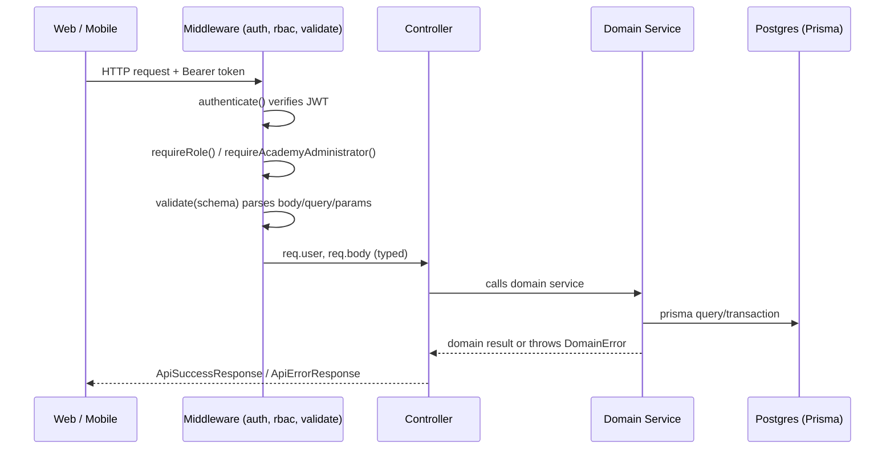

# System Architecture

## Status

Phase 1 (foundation). See `docs/decisions/` for the specific tradeoffs recorded as ADRs.

## Monorepo layout

```
apps/
  web/      Next.js (App Router) — player/coach/academy/scorer dashboards
  mobile/   Expo (React Native + Expo Router) — same four roles
  api/      Express + TypeScript backend — the single source of business logic

packages/
  types/        Shared enums, DTO shapes, API envelope contracts (no runtime deps)
  validation/   Shared zod schemas built on @karate/types
  constants/    Cross-environment constants (never differ by env)
  config/       Server-side env loading + validation (Node-only, never import from web/mobile)
  logger/       Structured logging (pino) with redaction
  shared/       Domain error hierarchy + small framework-agnostic helpers
  database/     Prisma schema (domain-organized, multi-file) + generated client

infrastructure/
  docker-compose.yml   Local Postgres + Redis

docs/
  architecture/   This directory
  database/       ERD
  decisions/      ADRs
```

Dependency direction is one-way: `apps/*` depend on `packages/*`; `packages/*` never depend on `apps/*`.
`@karate/database` is the only package that talks to Postgres — no other package or app imports
`@prisma/client` directly.

## Why one backend service, not microservices-per-table

The product brief lists ~20 business domains (identity, tournaments, scoring, stats, rankings, ...).
Splitting each into its own deployable service before there is a single real user would multiply
operational cost (20 databases, 20 deploy pipelines, cross-service transactions for things that are
naturally one transaction — e.g. resolving a membership request writes to both
`AcademyMembershipRequest` and `AcademyPlayerMembership`) without a corresponding benefit yet.

Phase 1 uses **one Express service with domain-oriented internal modules**
(`apps/api/src/modules/<domain>`), each with its own routes/controller/service files, sharing one
Postgres database organized into domain schemas at the Prisma level (`packages/database/prisma/schema/*.prisma`).
This keeps a clean seam to extract a domain into its own service later — the module boundary already
exists — without paying distributed-systems tax on day one.

## Why one backend, two clients

Web (Next.js) and Mobile (Expo) both call the same Express API over HTTP and share the same
`@karate/types` and `@karate/validation` packages. Neither client re-implements eligibility rules,
tournament-status transitions, or scoring logic — those live once, in `apps/api/src/domain/`.

## SportsHub integration boundary

`User.sportsHubIdentityId` (nullable, unique) is the seam for the parent SportsHub identity system.
Until that integration exists, `User` is fully self-contained (email/password). When SportsHub
identity is wired in, this column is populated and the Karate platform's `User` row becomes "the
Karate profile" for that global identity — no other table needs to change. See
[ADR-0002](../decisions/0002-sportshub-identity-boundary.md).

## Request flow (typical write)



## What Phase 1 does NOT implement

- Realtime transport (WebSocket/Socket.IO) — contracts are prepared for it (see
  `docs/architecture/13-realtime-architecture.md`) but not wired up.
- The scoring engine (Kumite/Kata point rules) — the schema and versioning model exist
  (`RuleSet`/`RuleSetVersion`/`ScoreEvent`), the rules themselves are not implemented.
- Draw/bracket generation algorithm.
- Notification delivery (email/push) — only the `Notification` table exists.
- SportsHub identity integration — only the boundary column exists.
