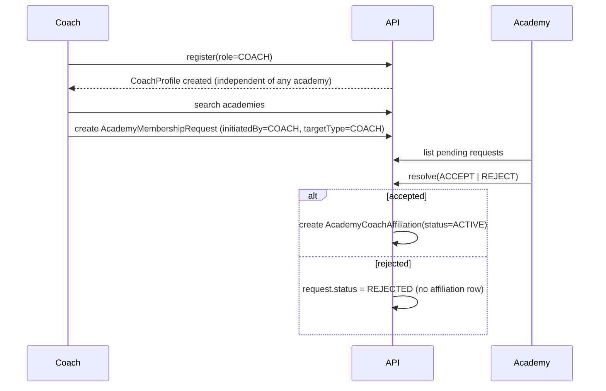

# Academy / Coach / Player Membership Flow

## Coach onboarding

A coach's profile always exists independently of any academy — nothing about a `CoachProfile` is
invalidated by having zero, one, or many affiliations.

## Player ↔ academy relationship

Same request/response shape, `targetType=PLAYER`, and either side can initiate
(`initiatedBy: ACADEMY | PLAYER | COACH` — a coach can initiate on behalf of a player they manage).
Resolving a request creates an `AcademyPlayerMembership`, never mutates the player or academy row
directly.

## Why history is a chain of rows, not a single mutable field

`AcademyPlayerMembership.status` moves through `INVITED → PENDING → ACTIVE → (LEFT | TRANSFERRED |
SUSPENDED | REJECTED)`. When a player transfers to a new academy, the OLD membership row is closed
(`status=TRANSFERRED`, `endedAt` set) and a NEW membership row is created for the new academy, linked
back via `previousMembershipId`. A player's full academy history is the chain of rows, queryable in
one pass — nothing is overwritten, so "which academy was this player at during the 2026 season" is
always answerable. `AcademyCoachAffiliation` follows the identical pattern via
`previousAffiliationId`.

## What Phase 1 implements vs. scaffolds

- **IMPLEMENTED**: schema (`AcademyMembershipRequest`, `AcademyPlayerMembership`,
  `AcademyCoachAffiliation`), and one real endpoint
  (`POST /api/v1/academies/:academyId/membership-requests/resolve`) demonstrating the
  accept/reject → membership-creation transaction (`apps/api/src/modules/academies/academies.service.ts`).
- **NOT IMPLEMENTED**: the "search academy" endpoint, the "send request" endpoint from the coach/player
  side, and any UI beyond the dashboard placeholder screens.
