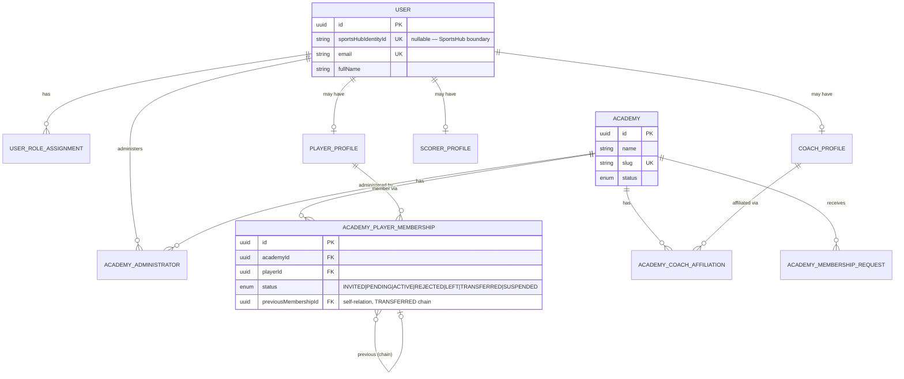
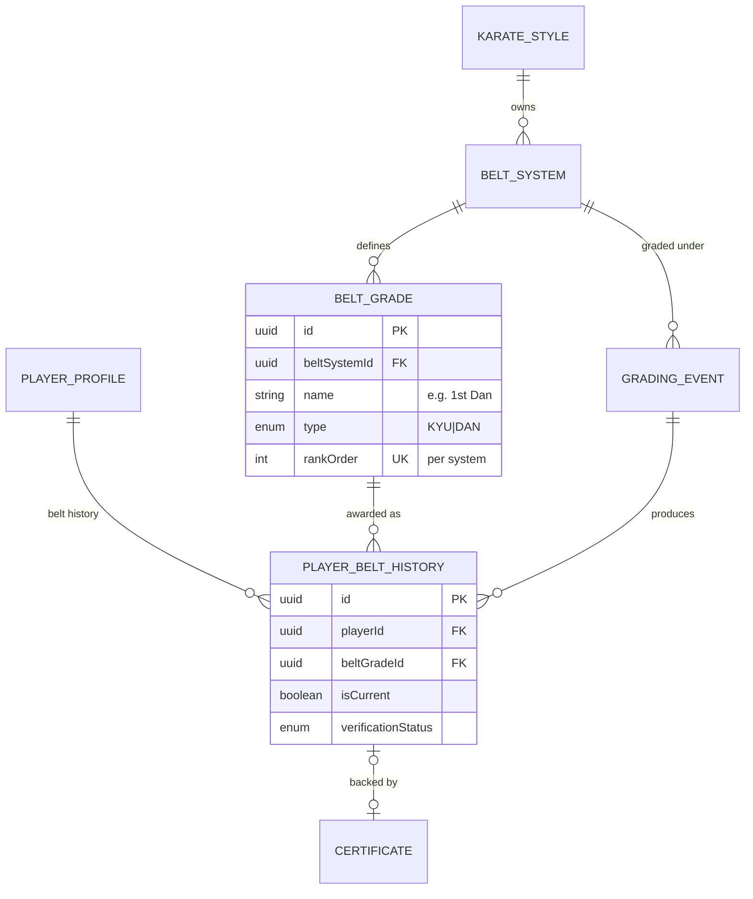
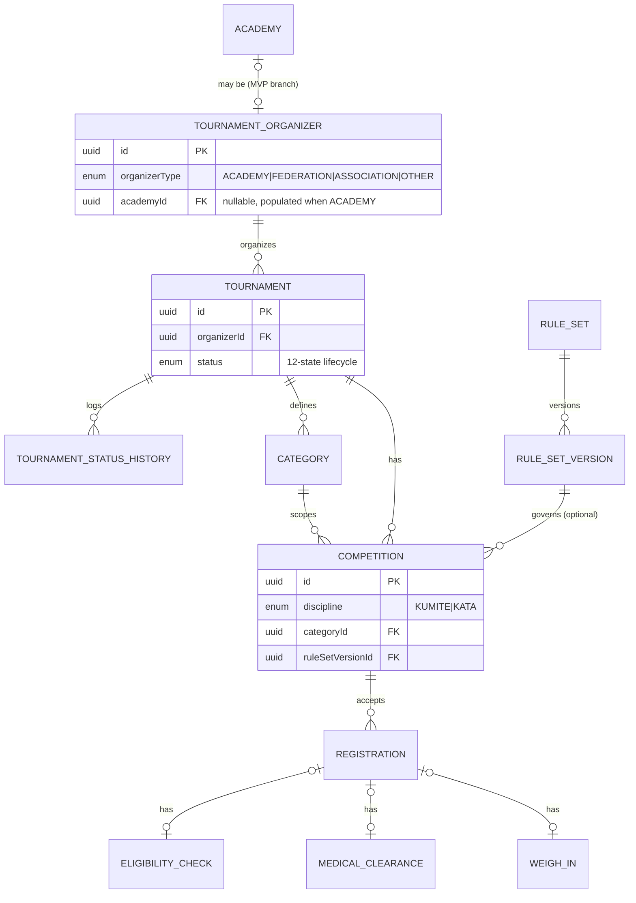
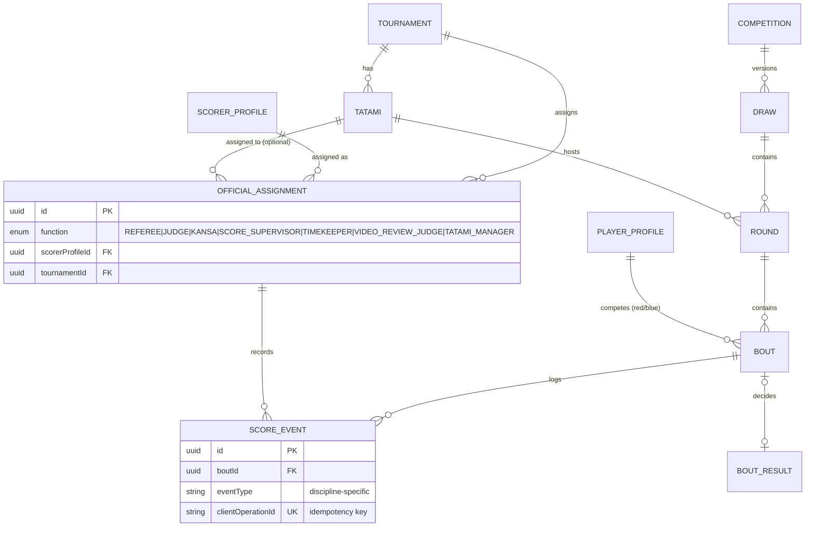
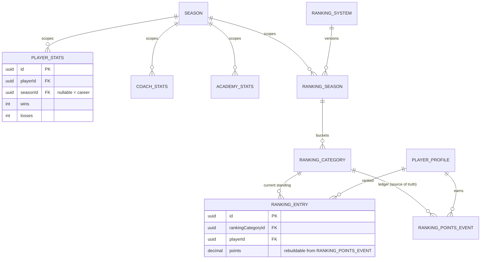

# Entity Relationship Diagrams

Split by domain cluster for readability. Field lists are trimmed to what clarifies the relationship —
see `packages/database/prisma/schema/*.prisma` for the authoritative, complete field list.

## Identity, Academy, Membership

## Belt & Grading

## Tournament & Competition

## Officials, Draws, Bouts, Scoring

## Stats & Rankings

