# LOC — Complete Data-Flow Documentation

This document is a codebase-verified map of **where every important piece of data lives in PostgreSQL, which API reads/writes it, and how it flows through the system**. It was built by reading `server/src/config/schema.sql`, every route/controller/service file, and the Cloudinary/session/auth code directly — not by assumption. Anything that could not be confirmed is marked `UNKNOWN — REQUIRES VERIFICATION`. Anything described elsewhere as planned but not actually built is marked `NOT IMPLEMENTED`.

**Source of truth note**: this project has two schema artifacts. `server/src/config/schema.sql` is executed wholesale on every `npm run db:migrate` (see `server/src/config/migrate.js`) and is the **real, live DDL**. `server/prisma/schema.prisma` is a stale, partially-outdated snapshot used only to generate `@prisma/client` for a handful of repositories (`sessions`, `otp_codes`, part of `grounds`, `staff_roles`). Every table/column below comes from `schema.sql`. Places where `schema.prisma` disagrees (is missing tables/columns that live in schema.sql) are noted inline as **"not in Prisma model"** — this is a real inconsistency in the codebase, not a documentation error.

**Backend**: Express 4, plain JavaScript (ESM), Node ≥20. Layering: `routes/*.routes.js` → `controllers/*.controller.js` → `services/*.service.js` → `models/*.model.js` (raw `pg` SQL, the majority) or `repositories/**` (some raw SQL repos + `repositories/prisma/*.prisma-repository.js` for the Prisma-backed subset). All routes are mounted under `/api`.

**Standalone diagrams**: every diagram in this file is also split into its own focused Mermaid file under [`docs/diagrams/`](diagrams/) (01–12, one topic each) for quicker reference without scrolling this whole document.

---

## Table of Contents

- [A. System Overview](#a-system-overview)
- [B. PostgreSQL Database Map](#b-postgresql-database-map)
  - [B1. Auth / Users / Sessions / MFA](#b1-auth--users--sessions--mfa)
  - [B2. Player & Team](#b2-player--team)
  - [B3. Matches & Scoring](#b3-matches--scoring)
  - [B4. Tournaments](#b4-tournaments)
  - [B5. Grounds & Ground Ops](#b5-grounds--ground-ops)
  - [B6. Booking Engine](#b6-booking-engine)
  - [B7. Umpire Module](#b7-umpire-module)
  - [B8. Canteen / Orders](#b8-canteen--orders)
  - [B9. Content / CMS](#b9-content--cms)
  - [B10. Social / Follow](#b10-social--follow)
- [C. Table-by-Table Data Dictionary](#c-table-by-table-data-dictionary)
- [D. Authentication & Login Flow](#d-authentication--login-flow)
- [E. Cloudinary / Image Upload Flow](#e-cloudinary--image-upload-flow)
- [F. API → Table → Data Flow](#f-api--table--data-flow)
- [G. End-to-End Feature Flows](#g-end-to-end-feature-flows)
- [H. "Where Is My Data?" Quick Reference](#h-where-is-my-data-quick-reference)
- [I. Example Request/Response](#i-example-requestresponse)
- [J. Closing Notes — Unknowns & Not-Implemented](#j-closing-notes--unknowns--not-implemented)

---

## A. System Overview

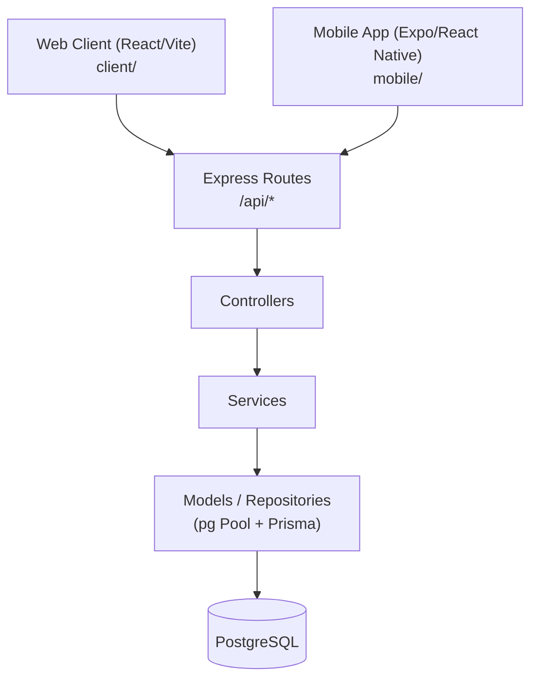

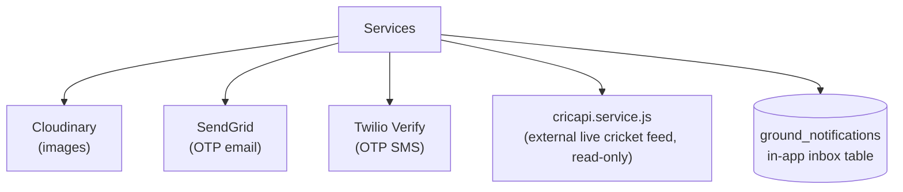

Notes:
- Both the web client and mobile app call the same `/api` REST surface — there is no separate mobile-only API.
- **No background job queue exists** (no Bull/Agenda/cron worker found) — `NOT IMPLEMENTED`. Anything that looks like a "trigger" (booking reminders, umpire slot reminders) is computed synchronously inside a request/service call, not by a scheduled worker.
- **No push notification provider** (no FCM/APNs/OneSignal) — `NOT IMPLEMENTED`. "Notifications" means an in-app database inbox only (`ground_notifications`), polled by the client.
- Realtime updates for live scoring use `server/src/realtime/` (Socket.IO), not covered in depth here since it doesn't change the DB story — it broadcasts state that was already written via the REST endpoints in [G. Match & Scoring](#match--scoring).
- **Payments: `NOT IMPLEMENTED`.** No payment gateway SDK, no webhook route exists anywhere in `server/src`. See [F](#payments--not-implemented) for the full explanation.

---

## B. PostgreSQL Database Map

### B1. Auth / Users / Sessions / MFA

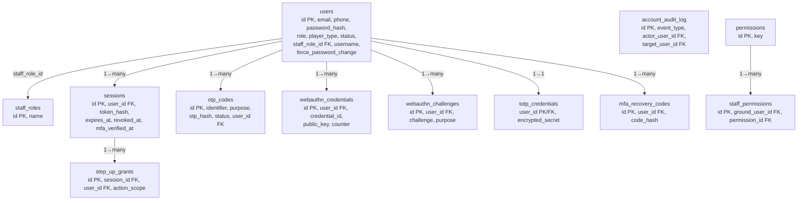

### B2. Player & Team

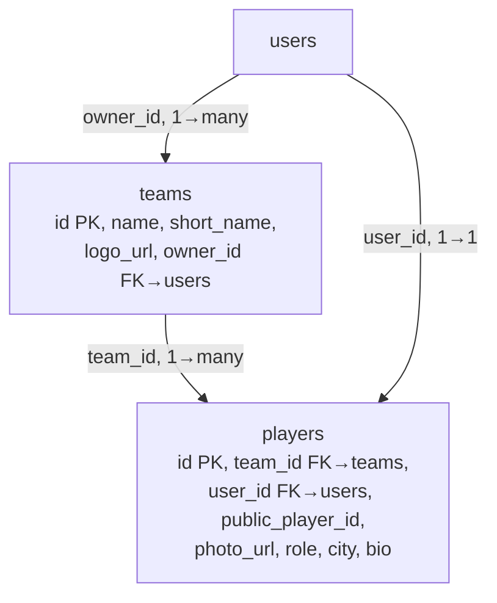

### B3. Matches & Scoring

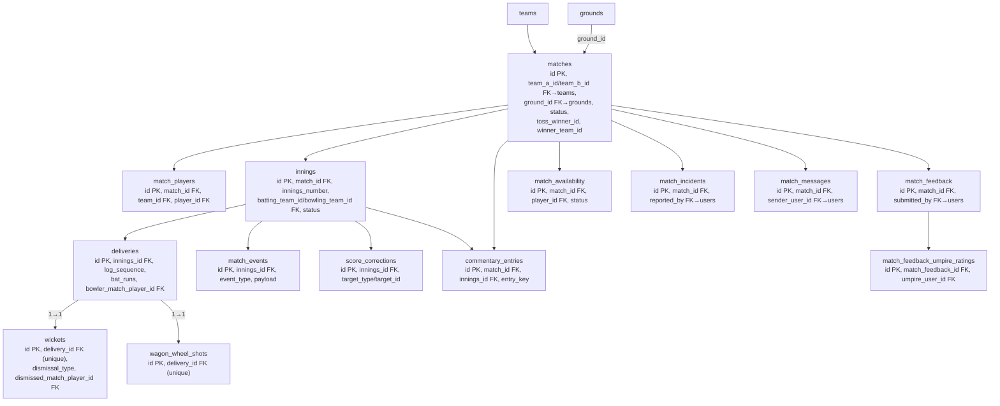

### B4. Tournaments

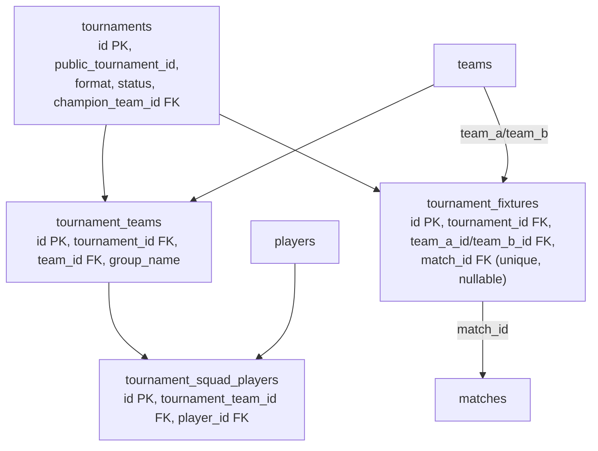

### B5. Grounds & Ground Ops

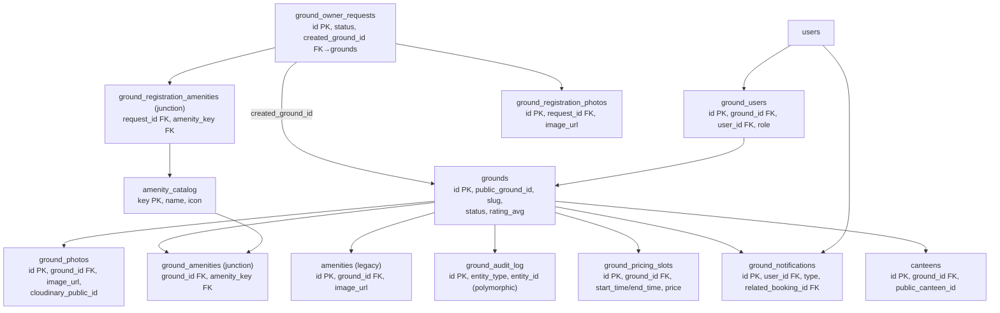

### B6. Booking Engine

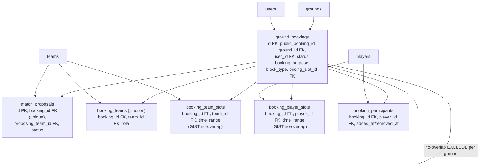

Booking conflict integrity is enforced by three **PostgreSQL GIST exclusion constraints** (not visible in `information_schema`, only `pg_constraint`): `ground_bookings_no_overlap` (same ground, overlapping time, status in HOLD/PROPOSED/PENDING/CONFIRMED), `booking_team_slots_no_overlap` (same team can't be double-booked), `booking_player_slots_no_overlap` (same player can't be double-booked). This is real double-booking prevention done at the database layer, not just application logic.

### B7. Umpire Module

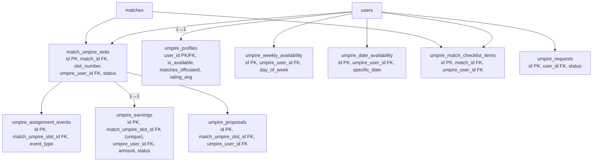

### B8. Canteen / Orders

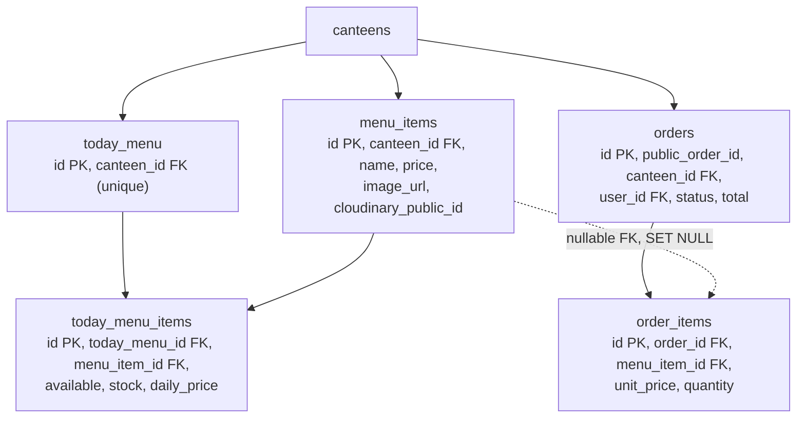

### B9. Content / CMS

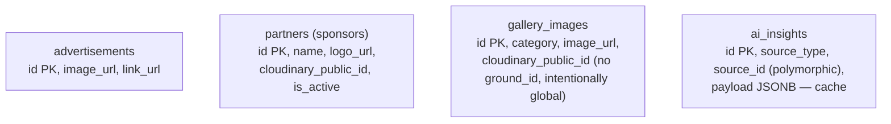

### B10. Social / Follow

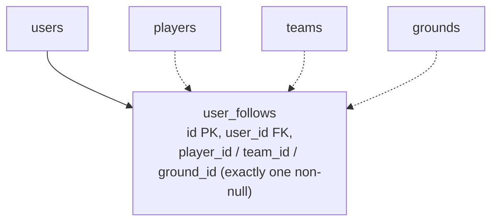

`user_follows` backs all three follow types with one table. `CHECK (num_nonnulls(player_id, team_id, ground_id) = 1)` guarantees exactly one target per row.

---

## C. Table-by-Table Data Dictionary

Legend: **PK** primary key, **FK** foreign key. "Created/Read/Updated/Deleted by" lists representative endpoints (see [Section F](#f-api--table--data-flow) for the exhaustive list per module).

### Auth / Users / Sessions / MFA

| Table | Purpose | Important Columns | PK | FK | Used By |
|---|---|---|---|---|---|
| `users` | Every account (players, umpires, staff, ground owners share this one table) | email, phone, password_hash, role, player_type, status, staff_role_id, username, force_password_change, temp_password_hash | id | staff_role_id→staff_roles | All modules — this is the hub table |
| `staff_roles` | Named platform-level roles for staff accounts | name (`super_admin`,`admin`,`canteen_staff`) | id | — | `users.staff_role_id`, `requireStaffRole` middleware |
| `sessions` | Active login sessions (session-cookie auth, Prisma-backed) | user_id, token_hash (SHA-256), expires_at, revoked_at, mfa_verified_at | id | user_id→users | Every authenticated request (`requireAuth`) |
| `otp_codes` | One-time codes for login/registration/password-reset, hashed | identifier, identifier_type, purpose, otp_hash, status, attempts, expires_at | id | user_id→users (nullable) | `/auth/send-otp`, `/auth/verify-otp`, `/auth/forgot-password`, `/auth/signup/*` |
| `webauthn_credentials` | Registered passkeys (not in Prisma model) | credential_id, public_key, counter, device_name | id | user_id→users | MFA `/auth/mfa/webauthn/*` |
| `webauthn_challenges` | Short-lived WebAuthn ceremony challenges (not in Prisma model) | challenge, purpose, expires_at | id | user_id→users | MFA WebAuthn register/verify |
| `totp_credentials` | TOTP (authenticator app) secrets, AES-256-GCM encrypted (not in Prisma model) | encrypted_secret, verified_at, disabled_at | user_id | user_id→users | `/auth/mfa/totp/*` |
| `mfa_recovery_codes` | One-time MFA recovery codes, hashed (not in Prisma model) | code_hash, used_at | id | user_id→users | `/auth/mfa/recovery-codes/regenerate` |
| `step_up_grants` | Short-lived "recently re-verified" grants for sensitive actions (not in Prisma model) | action_scope, expires_at, used_at | id | session_id→sessions, user_id→users | `/auth/step-up/*`, staff-create, permission-grant guards |
| `account_audit_log` | Immutable security/audit trail (~46-value event_type enum) | event_type, actor_user_id, target_user_id, metadata JSONB | id | actor_user_id/target_user_id→users, target_request_id→ground_owner_requests | Every auth/admin/ground-owner-approval mutation |
| `permissions` | Catalog of ground-scoped permission keys (not in Prisma model) | key (e.g. `MATCH_MANAGE`, `BOOKING_MANAGE`) | id | — | `staff_permissions`, `requireGroundPermission` |
| `staff_permissions` | Grants of a permission to a `ground_users` membership (not in Prisma model) | ground_user_id, permission_id, granted_by, revoked_at | id | ground_user_id→ground_users, permission_id→permissions | Ground Owner staff-permission screens |

### Player & Team

| Table | Purpose | Important Columns | PK | FK | Used By |
|---|---|---|---|---|---|
| `teams` | Cricket teams | name, short_name, logo_url, owner_id | id | owner_id→users | Matches, Tournaments, Bookings, Follow |
| `players` | Player profiles, one optional 1:1 link to a `users` account | team_id, user_id, public_player_id, photo_url, role, city, bio, date_of_birth | id | team_id→teams, user_id→users | Matches, Tournaments, Stats, Follow, Bookings |

### Matches & Scoring

| Table | Purpose | Important Columns | PK | FK | Used By |
|---|---|---|---|---|---|
| `matches` | A single cricket match | team_a_id, team_b_id, ground_id, status, toss_winner_id, winner_team_id, result_type, umpire_fee_amount | id | team_a/b_id, winner/toss_winner_id→teams, ground_id→grounds, cancelled_by→users | Scoring, Umpire assignment, Tournaments (via fixtures), Notifications |
| `match_players` | Which players are in a match's playing XI, per team | match_id, team_id, player_id, is_captain, is_wicketkeeper, batting_order | id | match_id→matches, team_id→teams, player_id→players | Deliveries, wickets, availability |
| `innings` | One innings of a match; also caches live running totals | match_id, innings_number, batting/bowling_team_id, status, runs, wickets, legal_balls, striker/bowler cache fields | id | match_id→matches, team fields→teams, striker/bowler fields→match_players | Live scoring, commentary |
| `deliveries` | Append-only ball-by-ball log — the single source of truth for scoring | innings_id, log_sequence, bat_runs, illegal_type, extra_type, bowler_match_player_id | id | innings_id→innings, bowler_match_player_id→match_players | Wickets, wagon wheel, commentary, score corrections |
| `wickets` | Dismissal detail for a delivery (1:1) | delivery_id (unique), dismissal_type, dismissed_match_player_id, fielder_match_player_id | id | delivery_id→deliveries, player fields→match_players | Scorecards, stats |
| `wagon_wheel_shots` | Shot placement coordinates for a delivery (1:1) | delivery_id (unique), normalized_x/y, angle_degrees, region_id | id | delivery_id→deliveries | Wagon wheel visualization |
| `match_events` | Non-delivery events (bowler change, retire, penalty, rain delay, etc.) | innings_id, event_type, payload JSONB | id | innings_id→innings, delivery_id→deliveries (nullable) | Commentary, live state |
| `score_corrections` | Immutable audit trail of scorer corrections/undos | innings_id, target_type/target_id (polymorphic), before_data/after_data JSONB, undoes_correction_id (self-FK) | id | innings_id→innings, corrected_by_user_id→users | Undo/correction endpoints |
| `commentary_entries` | Deterministic text commentary projected from deliveries/events | match_id, innings_id, entry_key, type, text, tags | id | match_id→matches, innings_id→innings, source_delivery/event_id | `GET /matches/:id/commentary` |
| `match_availability` | Player RSVP for a match | match_id, player_id, status (PENDING/AVAILABLE/NOT_AVAILABLE) | id | match_id→matches, player_id→players | Availability screens |
| `match_incidents` | Reported incidents during a match (rain, injury, misconduct, etc.) | match_id, reported_by, incident_type, description | id | match_id→matches, reported_by→users | Incident reporting, notifications |
| `match_messages` | In-match chat between Ground Owner and Umpire | match_id, sender_user_id, sender_role, body | id | match_id→matches, sender_user_id→users | Match messaging, notifications |
| `match_feedback` | Post-match feedback (ground + app ratings) | match_id, submitted_by, ground_rating, app_rating | id | match_id→matches, submitted_by→users | Feedback screens |
| `match_feedback_umpire_ratings` | Per-umpire rating child of `match_feedback` (added when umpire rating was split out) | match_feedback_id, umpire_user_id, rating | id | match_feedback_id→match_feedback, umpire_user_id→users | Umpire reputation/leaderboard |

### Tournaments

| Table | Purpose | Important Columns | PK | FK | Used By |
|---|---|---|---|---|---|
| `tournaments` | A tournament (league/groups+knockout/knockout) | public_tournament_id, format, status, start/end_date, champion_team_id | id | champion_team_id→teams, created_by→users | Fixtures, standings, analytics |
| `tournament_teams` | Teams registered into a tournament, optional group | tournament_id, team_id, group_name | id | tournament_id→tournaments, team_id→teams | Squad, fixtures, standings |
| `tournament_squad_players` | Historical squad snapshot per tournament team | tournament_id, tournament_team_id, player_id | id | tournament_team_id→tournament_teams, player_id→players | Squad management |
| `tournament_fixtures` | Bracket/league fixture, optionally linked to a real `matches` row | tournament_id, stage, team_a_id/team_b_id, match_id (unique, nullable), manual_result_winner_team_id | id | tournament_id→tournaments, team fields→teams, match_id→matches | Fixture generation, standings, analytics |

### Grounds & Ground Ops

| Table | Purpose | Important Columns | PK | FK | Used By |
|---|---|---|---|---|---|
| `grounds` | A cricket ground/venue | public_ground_id, slug, status, rating_avg, opening/closing_hour | id | — | Bookings, matches, umpire discovery, follow |
| `canteens` | A canteen belonging to a ground | ground_id, public_canteen_id, is_active | id | ground_id→grounds | Menu items, orders |
| `ground_users` | Ground-scoped RBAC membership (Owner/Admin/Canteen Staff/Umpire/Scorer) | ground_id, user_id, role, is_active | id | ground_id→grounds, user_id→users | `requireGroundRole`/`requireGroundPermission` |
| `ground_photos` | Ground gallery photos | image_url, cloudinary_public_id, ground_id, is_featured | id | ground_id→grounds | Ground profile pages |
| `amenities` | Legacy free-text amenity+photo (super-admin managed, pre-existing grounds) | name, image_url, cloudinary_public_id, ground_id | id | ground_id→grounds | Ground profile (legacy path) |
| `amenity_catalog` | Fixed LOC-controlled amenity list (not in Prisma model) | key (PK), name, icon | key | — | Ground registration, `ground_amenities` |
| `ground_registration_amenities` | Junction: registration request ↔ selected catalog amenities (not in Prisma model) | request_id, amenity_key | (request_id, amenity_key) | request_id→ground_owner_requests, amenity_key→amenity_catalog | Ground registration wizard |
| `ground_registration_photos` | Photos uploaded during ground registration (not in Prisma model) | request_id, image_url, cloudinary_public_id, is_featured | id | request_id→ground_owner_requests | Ground registration wizard |
| `ground_amenities` | Junction: an approved ground ↔ catalog amenities (not in Prisma model) | ground_id, amenity_key | (ground_id, amenity_key) | ground_id→grounds, amenity_key→amenity_catalog | Ground profile |
| `ground_owner_requests` | Applications to register a new ground (approval workflow) | applicant info, ground info, status, reviewed_by, created_ground_id | id | reviewed_by→users, created_ground_id→grounds, submitted_by_user_id→users | `/grounds` POST (registerGround), admin review queue |
| `ground_audit_log` | Audit trail for booking/block/proposal/pricing-slot actions (polymorphic) | entity_type, entity_id, action, actor_user_id | id | actor_user_id→users | Ground ops audit views |
| `ground_notifications` | In-app notification inbox (the entire "Notifications" feature) | user_id, type (~37-value enum), title, body, related_booking_id/match_id/ground_id/order_id, is_read | id | user_id→users, related_*→ground_bookings/matches/grounds/orders | Every feature that fires a notification |
| `ground_pricing_slots` | Time-of-day pricing rules for a ground (not in Prisma model) | ground_id, start_time/end_time, price, is_active | id | ground_id→grounds | Booking price calc |

### Booking Engine

| Table | Purpose | Important Columns | PK | FK | Used By |
|---|---|---|---|---|---|
| `ground_bookings` | Every booking or staff block on a ground (walk-in, team booking, or maintenance block) | public_booking_id, booking_type, ground_id, user_id, status, booking_purpose, block_type, amount, pricing_slot_id, proposal_id | id | ground_id→grounds, user_id→users, proposal_id→match_proposals, pricing_slot_id→ground_pricing_slots | Booking APIs, notifications, umpire slot generation (matches created from a booking) |
| `match_proposals` | "Looking for opponent" open match slots (not in Prisma model) | public_proposal_id, ground_id, booking_id (unique), proposing_team_id, status, accepted_by_team_id | id | ground_id→grounds, booking_id→ground_bookings, team fields→teams | Match proposal APIs |
| `booking_teams` | Which teams are attached to a booking, Home/Away (not in Prisma model) | booking_id, team_id, role | id | booking_id→ground_bookings, team_id→teams | Team booking display |
| `booking_team_slots` | Per-team time-range conflict guarantee, GIST exclusion (not in Prisma model) | booking_id, team_id, time_range | id | booking_id→ground_bookings, team_id→teams | Booking-conflict engine |
| `booking_player_slots` | Per-player time-range conflict guarantee, GIST exclusion (not in Prisma model) | booking_id, player_id, time_range | id | booking_id→ground_bookings, player_id→players | Booking-conflict engine |
| `booking_participants` | Permanent historical roster of players attached to a booking (not in Prisma model) | booking_id, player_id, added_at, removed_at | id | booking_id→ground_bookings, player_id→players | Booking history |

### Umpire Module

| Table | Purpose | Important Columns | PK | FK | Used By |
|---|---|---|---|---|---|
| `umpire_requests` | Approval request to become an umpire | user_id, status, decided_by | id | user_id→users, decided_by→users | Registration approval queue |
| `match_umpire_slots` | An umpire slot on a match, assigned or open | match_id, slot_number, status, umpire_user_id, incentive_amount, checked_in_at | id | match_id→matches, umpire_user_id→users | Assignment, check-in, earnings |
| `umpire_profiles` | Umpire's own profile/stats (1:1 with users) | bio, is_available, matches_officiated, rating_avg | user_id | user_id→users | Umpire self-profile |
| `umpire_weekly_availability` | Recurring weekly availability | day_of_week, is_available | id | umpire_user_id→users | Slot-eligibility checks |
| `umpire_date_availability` | One-off date overrides | specific_date, start_time/end_time, is_available | id | umpire_user_id→users | Slot-eligibility checks |
| `umpire_assignment_events` | Append-only history of slot assignment/cancellation/no-show/replacement | match_umpire_slot_id, match_id, event_type | id | match_umpire_slot_id→match_umpire_slots, umpire_user_id→users | Assignment history views |
| `umpire_match_checklist_items` | Pre-match checklist items an umpire ticks off | match_id, umpire_user_id, item_key, is_checked | id | match_id→matches, umpire_user_id→users | Match-day checklist |
| `umpire_earnings` | Per-slot earning record with a manual payment status | match_umpire_slot_id (unique), umpire_user_id, amount, status | id | match_umpire_slot_id→match_umpire_slots, umpire_user_id→users | Earnings screen (no real payment gateway backs this) |
| `umpire_proposals` | Ground Owner's direct offer of a slot to a specific umpire | match_umpire_slot_id, proposed_by, umpire_user_id, incentive_amount, status | id | match_umpire_slot_id→match_umpire_slots, users fields→users | Proposal inbox/response |

### Canteen / Orders

| Table | Purpose | Important Columns | PK | FK | Used By |
|---|---|---|---|---|---|
| `menu_items` | A canteen's master menu item | canteen_id, name, price, image_url, cloudinary_public_id, default_stock | id | canteen_id→canteens | Menu management, today's menu |
| `today_menu` | Today's published menu for a canteen (practical singleton per canteen) | canteen_id (unique) | id | canteen_id→canteens | Ordering screen |
| `today_menu_items` | Which items are available today, with stock/daily price overrides | today_menu_id, menu_item_id, available, stock, daily_price | id | today_menu_id→today_menu, menu_item_id→menu_items | Ordering screen |
| `orders` | A customer's canteen order | public_order_id, canteen_id, user_id, status, total | id | canteen_id→canteens, user_id→users | Order placement/tracking |
| `order_items` | Line items of an order, price snapshotted at order time | order_id, menu_item_id (nullable), unit_price, quantity | id | order_id→orders, menu_item_id→menu_items (SET NULL) | Order detail/receipt |

### Content / CMS

| Table | Purpose | Important Columns | PK | FK | Used By |
|---|---|---|---|---|---|
| `advertisements` | Home-screen ad banners | image_url, link_url, sort_order | id | — | Home screen |
| `partners` | Sponsors/partners shown on the site | name, logo_url, cloudinary_public_id, is_active, description | id | — | Sponsors section |
| `gallery_images` | Global photo gallery (deliberately not ground-scoped) | category, image_url, cloudinary_public_id, image_width/height/format/bytes | id | created_by→users | Gallery page |
| `ai_insights` | Cache of AI-generated insight text for a match/player/team/umpire | source_type, source_id (polymorphic), source_fingerprint, payload JSONB | id | — | AI Insight sections |

### Social / Follow

| Table | Purpose | Important Columns | PK | FK | Used By |
|---|---|---|---|---|---|
| `user_follows` | A user following a player, team, or ground (exactly one target per row) | user_id, player_id/team_id/ground_id (exactly one non-null) | id | user_id→users, player_id→players, team_id→teams, ground_id→grounds | Follow buttons, `/me/following` |

---

## D. Authentication & Login Flow

LOC's primary auth mechanism is an **httpOnly signed session cookie**, not a bearer JWT returned in the response body. A legacy JWT bearer-token code path (`signToken`/`verifyToken`) still exists in `requireAuth` but nothing in the currently active login flow calls `signToken` anymore — it survives only for integration-test fixtures and old tokens issued before this design.

### D1. OTP Login / Registration

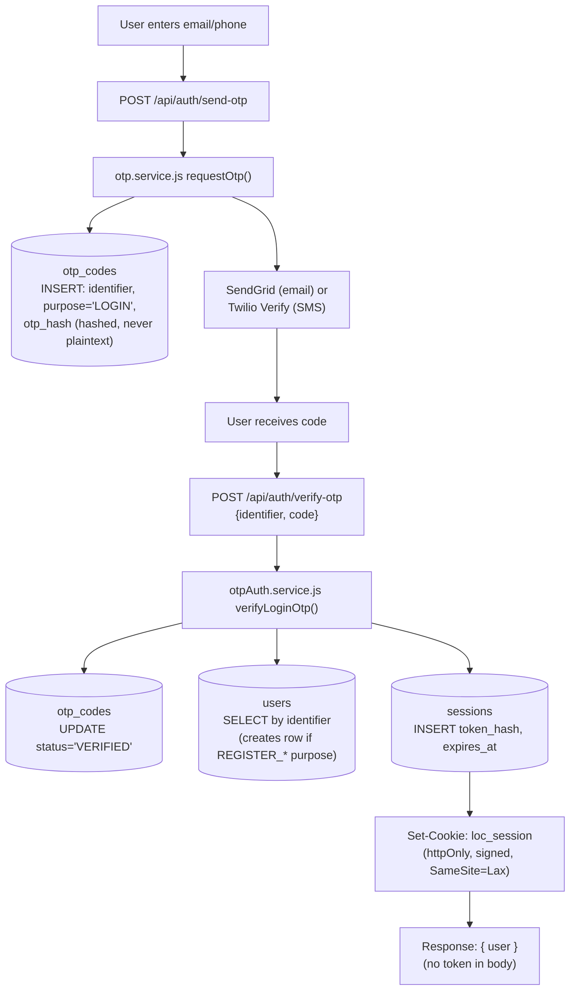

### D2. Password Login

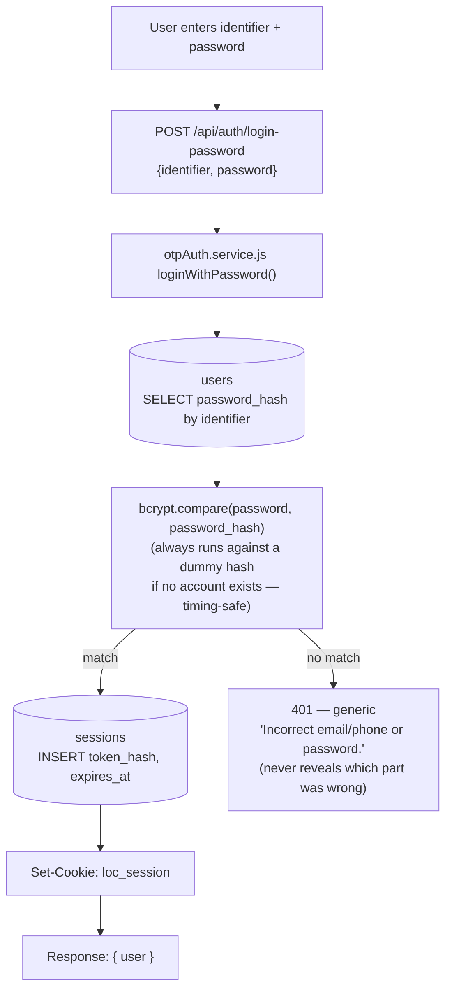

### D3. Authenticated Request (`requireAuth`)

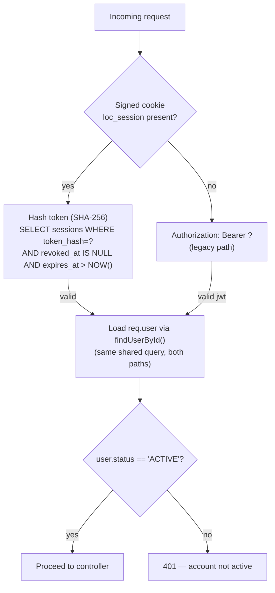

### Key facts (verified in code)

| Question | Answer |
|---|---|
| Password hashing library | `bcryptjs`, cost factor `10` (`bcrypt.hash(password, 10)`) |
| Is password ever stored/returned in plaintext? | No — `users.password_hash` is never in the `PUBLIC_COLUMNS` projection used by every response-building query |
| Is password ever logged? | No — failures log a masked identifier only |
| OTP storage | `otp_codes.otp_hash` — hashed, not plaintext; single-use (`status` transitions PENDING→VERIFIED/EXPIRED/LOCKED) |
| Access/refresh token model | **No JWT refresh-token pair.** A random 256-bit session token is generated per login; only its SHA-256 hash is stored (`sessions.token_hash`); the raw token itself lives only in the httpOnly cookie |
| Session cookie name | `loc_session` — httpOnly, `secure` in production, `SameSite=Lax`, signed via `cookie-parser` with `SESSION_COOKIE_SECRET` |
| Session lifetime | `SESSION_TTL_DAYS` env var (default 30 days) |
| Logout | `POST /api/auth/logout` → sets `sessions.revoked_at` for that session's token_hash |
| Revocation on password change/reset | `revokeAllSessionsForUser` (all sessions) on reset; `revokeAllSessionsForUserExceptCurrent` (all but the acting session) on in-session change-password |
| "Blacklist" table | None separate — `sessions.revoked_at IS NOT NULL` is the revocation marker |
| How the backend identifies "current user" | `middlewares/auth.js#requireAuth` — cookie branch (primary) or legacy JWT bearer branch, both converging on the same `findUserById()` so `req.user`'s shape is identical either way |
| Role storage | `users.role` (`user`/`player`/`staff`) + `users.player_type` (`team_player`/`umpire`, meaningful only when role='player') + `users.staff_role_id → staff_roles.name` (`super_admin`/`admin`/`canteen_staff`) + ground-scoped `ground_users.role` (`GROUND_OWNER`/`GROUND_ADMIN`/`CANTEEN_STAFF`/`UMPIRE`/`SCORER`) |
| Relevant env var names (not values) | `JWT_SECRET`, `SESSION_COOKIE_SECRET`, `DATABASE_URL`, `PG_*`, `MFA_ENCRYPTION_KEY`, `WEBAUTHN_RP_ID`/`RP_NAME`/`ORIGIN`, `SESSION_TTL_DAYS`, `OTP_LENGTH`, `OTP_TTL_MINUTES`, `TWILIO_*`, `SENDGRID_*`, `CLOUDINARY_*` |
| MFA (WebAuthn/TOTP/step-up) | Fully implemented (routes, tables, encryption) — **but `services/mfaState.service.js#computeMfaVerified()` is hardcoded to `return true`**, per an explicit code comment stating MFA enforcement was removed at the project owner's request. So MFA machinery exists but currently enforces nothing at runtime. |

---

## E. Cloudinary / Image Upload Flow

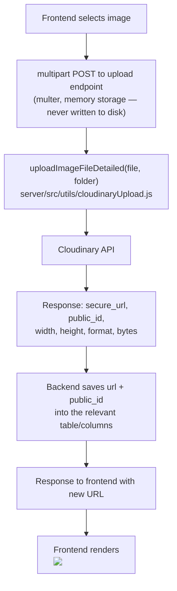

Validation is shared across every upload route: `image/jpeg`, `image/jpg`, `image/png`, `image/webp` only, max 10MB.

### Per-feature mapping (verified per controller)

| Feature | Endpoint | Cloudinary folder | Table.column(s) | `public_id` stored? | Delete/replace behavior |
|---|---|---|---|---|---|
| Player profile photo | `POST /api/me/player/photo` | `LOC/player-photos` | `players.photo_url` | **No** — `players` has no public_id column | Old photo is **never deleted** from Cloudinary on replace (no way to know it's a Cloudinary asset vs. an arbitrary URL) |
| Ground photos (super admin) | `POST /api/ground-photos/upload` | `LOC/ground-photos` | `ground_photos.image_url`, `.cloudinary_public_id` | Yes | `cloudinary.uploader.destroy()` called on delete/replace; rollback-on-DB-failure (upload undone if the DB write fails) |
| Ground media (Ground Owner self-service) | `POST /api/ground-owner/grounds/:id/media/upload` | `LOC/ground-photos` | `ground_photos.image_url`, `.cloudinary_public_id` | Yes | Same delete + rollback pattern |
| Amenities (super admin, legacy) | `POST /api/amenities/upload` | `LOC/amenities` | `amenities.image_url`, `.cloudinary_public_id` | Yes | `destroy()` on delete/replace |
| Gallery images | `POST /api/gallery` | `LOC/ground-gallery` | `gallery_images.image_url`, `.cloudinary_public_id` (+width/height/format/bytes) | Yes | Cloudinary delete happens **before** the DB row delete; DB row only removed if Cloudinary confirms success or "not found" |
| Partners/sponsor logos | `POST /api/partners/upload`, `PATCH /api/partners/:id` | `LOC/partners` | `partners.logo_url`, `.cloudinary_public_id` | Yes | Old logo deleted only after the DB update commits |
| Ground registration photos (wizard) | `POST /api/ground-owner-requests/photos` | `LOC/ground-registration-photos` | `ground_registration_photos.image_url`, `.cloudinary_public_id` | Yes | Attached to the registration request row once submitted |
| Canteen menu item images | menu item create/update (multipart field `imageFile`, folder `canteen-menu`) | `canteen-menu` | `menu_items.image_url`, `.cloudinary_public_id` | Yes (uses `uploadImageFileDetailed`, verified directly in `canteenMenu.controller.js`) | Old image replaced via `deleteImageByPublicId` on update |
| Team logo | *(not a Cloudinary upload)* | — | `teams.logo_url` | N/A | Client supplies an arbitrary URL string directly in the request body — no multer/Cloudinary involved at all |

Two other patterns exist: an image can also be added by supplying a raw external `imageUrl` in the request body (bypassing Cloudinary entirely) for ground photos/amenities — in that case `cloudinary_public_id` is explicitly set to `null`, and delete code correctly skips `destroy()` when `public_id` is null.

Deletion helper: `deleteImageByPublicId(publicId)` → `cloudinary.uploader.destroy(publicId, {resource_type:'image'})`. Optimized delivery URLs (`f_auto,q_auto`, optional width cap) are generated on the fly via `getOptimizedImageUrl()` rather than storing multiple copies.

---

## F. API → Table → Data Flow

All paths are relative to `/api`. "Auth" column: `public` = no auth required, `auth` = `requireAuth` only, a role name = additionally gated by that role/permission.

### Auth

| API | Method | Reads | Writes | External | Auth |
|---|---|---|---|---|---|
| `/auth/send-otp` | POST | `otp_codes` (cooldown check) | `otp_codes` | SendGrid/Twilio | public |
| `/auth/verify-otp` | POST | `otp_codes`, `users` | `otp_codes`, `users` (if new), `sessions` | — | public |
| `/auth/login-password` | POST | `users` | `sessions` | — | public |
| `/auth/logout` | POST | `sessions` | `sessions.revoked_at` | — | auth |
| `/auth/register/player`, `/auth/register/umpire` | POST | `otp_codes` | `otp_codes` (staged) | SendGrid/Twilio | public |
| `/auth/forgot-password` | POST | `otp_codes` | `otp_codes` | SendGrid/Twilio | public |
| `/auth/reset-password` | POST | `otp_codes`, `users` | `users.password_hash`, `sessions` (revoke all) | — | public |
| `/auth/signup/send-code`, `/verify-code`, `/create-account` | POST | `otp_codes` | `otp_codes`, `users` | SendGrid/Twilio | public |
| `/auth/me` | GET | `users` (via `findUserById`) | — | — | auth |
| `/auth/role`, `/auth/player-type` (PATCH) | PATCH | `users` | `users.role`/`player_type`, may create `umpire_requests` | — | auth |
| `/auth/change-password` | POST | `users` | `users.password_hash`, `sessions` (revoke others) | — | auth |
| `/auth/mfa/*`, `/auth/step-up/*` | various | `webauthn_*`, `totp_credentials`, `mfa_recovery_codes`, `step_up_grants` | same tables | — | auth |

### Player & Team

| API | Method | Reads | Writes | Auth |
|---|---|---|---|---|
| `/me/player` | GET/PATCH | `players` | `players` | auth |
| `/me/player/photo` | POST | — | `players.photo_url` | auth (Cloudinary) |
| `/players`, `/players/:id` | GET | `players`, `teams` | — | public |
| `/teams`, `/teams/discover`, `/teams/:id/profile` | GET | `teams`, `players` | — | public |
| `/teams/:id`, `/teams/:id/players` | GET | `teams`, `players` | — | auth |
| `/teams` | POST | `players` (validate) | `teams` | auth + role `player` |
| `/teams/:id/players` | POST/DELETE | `teams` | `players.team_id` | auth + role `staff` |

### Matches & Scoring

| API | Method | Reads | Writes | Auth |
|---|---|---|---|---|
| `/matches`, `/matches/discover`, `/matches/home` | GET | `matches`, `teams` | — | public |
| `/matches` | POST | — | `matches`, `match_umpire_slots`, `umpire_earnings` | `requireStaffRole('super_admin')` |
| `/matches/:id`, `/:id/summary`, `/:id/live-state`, `/:id/commentary` | GET | `matches`, `innings`, `commentary_entries` | — | public |
| `/matches/:id/toss`, `/checkin`, `/start`, `/finalize` | PATCH/POST | `matches` | `matches.*` | auth + scorer gate |
| `/matches/:matchId/match-players` | GET/POST | `match_players` | `match_players` | POST = scorer gate |
| `/matches/:matchId/innings` | GET/POST | `innings` | `innings` | POST = scorer gate |
| `/innings/:id/deliveries` | POST | — | `deliveries`, `wickets`, `wagon_wheel_shots`, `innings` (totals) | auth + scorer gate |
| `/innings/:id/events` | POST | — | `match_events` | auth + scorer gate |
| `/innings/:id/corrections`, `/undo` | POST | `deliveries`/`wickets` | `score_corrections`, corrected rows | auth + scorer gate |
| `/matches/:id/incidents` | GET/POST | `match_incidents` | `match_incidents` (+ `ground_notifications`) | auth + scorer gate |
| `/matches/:matchId/messages` | GET/POST | `match_messages` | `match_messages` (+ `ground_notifications`) | auth |
| `/matches/:matchId/availability`, `/me/availability/:matchId` | GET/PATCH | `match_availability` | `match_availability` | auth |
| `/matches/:matchId/feedback` | GET/POST | `match_feedback` | `match_feedback`, `match_feedback_umpire_ratings` | auth |
| `/india-match/featured` | GET | — (external only) | — | public — reads `cricapi.service.js`, no DB |

### Tournaments

| API | Method | Reads | Writes | Auth |
|---|---|---|---|---|
| `/tournaments`, `/:id`, `/:id/teams`, `/:id/squad`, `/:id/fixtures`, `/:id/standings`, `/:id/statistics`, `/:id/analytics` | GET | `tournaments`, `tournament_teams`, `tournament_squad_players`, `tournament_fixtures`, `matches`, `innings` | — | public |
| `/tournaments` | POST | — | `tournaments` | staff |
| `/:id/open-registration`, `/:id/complete` | POST | `tournaments` | `tournaments.status` | staff |
| `/:id/teams`, `/:id/squad` | POST/DELETE | `tournament_teams` | `tournament_teams`, `tournament_squad_players` | staff |
| `/:id/fixtures/generate` | POST | `tournament_teams` | `tournament_fixtures` | staff |
| `/:id/fixtures/:fixtureId/schedule`, `/resolve` | PATCH/POST | `tournament_fixtures` | `tournament_fixtures`, may create `matches`/`ground_bookings` | staff |

### Grounds & Booking

| API | Method | Reads | Writes | Auth |
|---|---|---|---|---|
| `/grounds/nearby`, `/search`, `/cities`, `/`, `/:id` | GET | `grounds`, `ground_photos` | — | public |
| `/grounds` | POST (registerGround) | — | `ground_owner_requests` (not `grounds` directly) | auth |
| `/bookings/availability` | GET | `ground_bookings` | — | public |
| `/bookings` | POST | — | `ground_bookings` (+ `ground_notifications`) | auth |
| `/bookings/my`, `/history` | GET | `ground_bookings` | — | auth / staff |
| `/bookings/:id/cancel` | POST | `ground_bookings` | `ground_bookings.status` | auth |
| `/bookings/staff/schedule`, `/staff/block` | GET/POST/DELETE | `ground_bookings` | `ground_bookings` (BLOCK rows) | staff |
| `/grounds/:id/bookings` (team booking) | POST | — | `ground_bookings`, `booking_teams`, `booking_team_slots`, `booking_player_slots`, `booking_participants` | auth |
| `/grounds/:id/bookings/:id/cancel`, `/check-in`, `/no-show` | POST | `ground_bookings` | `ground_bookings.status`, `booking_participants` | auth/staff |
| `/grounds/:id/proposals` | GET/POST/`:id/accept`/`:id/cancel` | `match_proposals` | `match_proposals` (+ `ground_notifications`) | public GET, auth for mutations |
| `/ground-owner/grounds`, `/:id` | GET/PATCH | `ground_users`, `grounds` | `grounds` | `requireGroundRole('GROUND_OWNER')` |
| `/ground-owner/grounds/:id/dashboard`, `/analytics*` | GET | `ground_bookings`, `menu_items`, `orders` | — | ground owner |
| `/ground-owner/grounds/:id/notifications` | GET/POST | `ground_notifications` | `ground_notifications.read_at` | ground role |
| `/ground-owner/grounds/:id/media*` | GET/POST/DELETE/PATCH | `ground_photos` | `ground_photos` | ground role (Cloudinary) |
| `/ground-owner/grounds/:id/amenities` | GET/POST/DELETE | `ground_amenities` | `ground_amenities` | ground role |
| `/ground-owner/grounds/:id/pricing-slots` | GET/POST/PATCH/DELETE | `ground_pricing_slots` | `ground_pricing_slots` | ground role |
| `/ground-owner/grounds/:id/staff` | GET/POST/DELETE/PATCH | `ground_users` | `ground_users` | ground owner only |
| `/ground-owner-requests` | POST (submit), GET (queue) | `ground_owner_requests` | `ground_owner_requests`, `ground_registration_photos`, `ground_registration_amenities` | public submit, super_admin review |
| `/ground/notifications`, `/:id/read`, `/read-all` | GET/POST | `ground_notifications` | `ground_notifications.read_at` | auth |
| `/ground` (timeline/dashboard/reports/audit-log) | GET | `ground_bookings`, `ground_audit_log` | — | public timeline, staff for the rest |

### Umpire

| API | Method | Reads | Writes | Auth |
|---|---|---|---|---|
| `/umpire-requests/me`, `/umpire-requests` | GET | `umpire_requests` | — | auth / super_admin |
| `/umpire-requests/:id` | PATCH | `umpire_requests` | `umpire_requests.status` | super_admin |
| `/matches/:id/umpire-slots`, `/apply`, `/cancel` | GET/POST | `match_umpire_slots`, `umpire_weekly_availability`, `umpire_date_availability` | `match_umpire_slots`, `umpire_assignment_events` | auth |
| `/umpire/matches/available`, `/assignments` | GET | `matches`, `match_umpire_slots` | — | approved umpire |
| `/umpire/profile` | GET/PATCH | `umpire_profiles` | `umpire_profiles` | approved umpire |
| `/umpire/availability*` | GET/PATCH/DELETE | `umpire_weekly_availability`, `umpire_date_availability` | same | approved umpire |
| `/umpire/earnings` | GET | `umpire_earnings` | — | approved umpire |
| `/umpire/ai-insight`, `/regenerate` | GET/POST | `ai_insights` | `ai_insights` | approved umpire (rate-limited) |
| `/umpire/proposals`, `/:id/respond` | GET/POST | `umpire_proposals` | `umpire_proposals` (+ `ground_notifications`) | approved umpire |
| Ground-Owner side: no-show/replace/history/recommend/incidents/propose, `PATCH .../payment-status` | various | `match_umpire_slots`, `umpire_assignment_events` | same + `umpire_earnings.status` (manual) | ground permission |
| `/stats/top-umpires` | GET | `match_umpire_slots`, `match_feedback_umpire_ratings` | — | public |

### Notifications, Follow, Stats

| API | Method | Reads | Writes | Auth |
|---|---|---|---|---|
| `/ground/notifications`, `/:id/read`, `/read-all` | GET/POST | `ground_notifications` | `ground_notifications.read_at` | auth |
| `/players/:id/follow`, `/teams/:id/follow`, `/grounds/:id/follow` | GET/POST/DELETE | `user_follows` | `user_follows` (ON CONFLICT DO NOTHING) | auth |
| `/me/following` | GET | `user_follows` joined with `players`/`teams`/`grounds` | — | auth |
| `/players` (search), `/players/:id/stats`, `/me/stats` | GET | `players`, `matches`, `innings`, `match_players`, `wickets` | — | public / auth |
| `/stats/leaderboards/:metric`, `/stats/records` | GET | aggregates over `innings`/`wickets`/`match_players`/`matches` | — | public |
| `/players/compare`, `/players/head-to-head`, `/:id/analytics` | GET | `innings`, `deliveries`, `wickets`, `match_players` | — | public |
| `/teams/compare`, `/teams/:id/analytics` | GET | `tournament_teams`, `matches`, `innings` | — | public |
| `/matches/:id/analytics` | GET | `innings`, `deliveries`, `wickets` | — | public |

### Canteen

| API | Method | Reads | Writes | External |
|---|---|---|---|---|
| Menu item create/update (with `imageFile`) | POST/PATCH | `menu_items` | `menu_items` | Cloudinary |
| Today's menu publish | POST | `menu_items` | `today_menu`, `today_menu_items` | — |
| Order placement | POST | `today_menu_items` (stock check) | `orders`, `order_items` | — |
| Order status update | PATCH | `orders` | `orders.status` (+ `ground_notifications`) | — |

### Payments — `NOT IMPLEMENTED`

Confirmed by an explicit code comment in `server/src/domain/umpireCommerce/paymentStatus.js`: *"No payment gateway exists anywhere in this codebase (confirmed by audit)... FAILED is reachable only as a manual Ground Owner override."*

- No Stripe/Razorpay/PayU/Paytm SDK, no webhook route/handler anywhere in `server/src`.
- `umpire_earnings.status` / `match_umpire_slots` payment fields are manual enum values (`PENDING/APPROVED/PAID/FAILED/CANCELLED`) set only by a Ground Owner via `PATCH /ground-owner/grounds/:id/matches/:matchId/umpire-slots/:slotId/payment-status` — not tied to any real transaction.
- `ground_bookings.amount` exists as a column but there is no charge/checkout step anywhere in the booking flow.
- Canteen `orders`/`order_items` imply cash/manual settlement — no gateway integration.

---

## G. End-to-End Feature Flows

### Auth

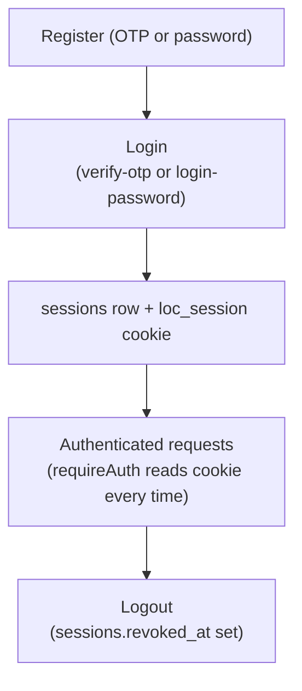

### Player / Team Profile

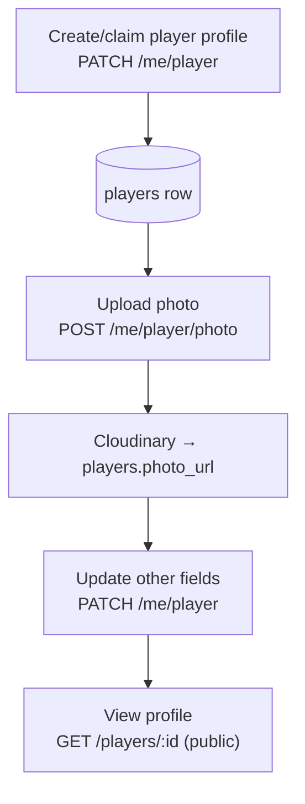

### Match & Scoring

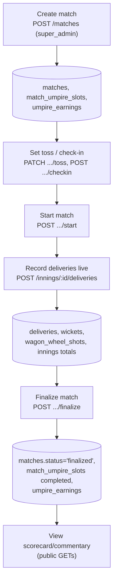

### Tournament

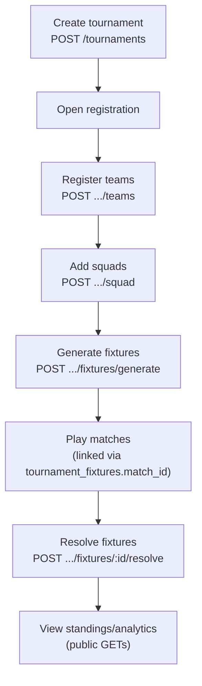

### Ground & Booking

```mermaid
flowchart TD
    A["Search ground\nGET /grounds/search"] --> B["View profile\nGET /grounds/:id"]
    B --> C["Create booking\nPOST /grounds/:id/bookings"]
    C --> D[("ground_bookings + junction tables\n(GIST no-overlap checked)")]
    D --> E["Check-in / cancel / no-show"]
    E --> F["Ground Owner dashboard\n(analytics over ground_bookings)"]
```

### Umpire

```mermaid
flowchart TD
    A["Register as umpire\n(OTP purpose REGISTER_UMPIRE)"] --> B[("umpire_requests, pending")]
    B --> C["Super admin approves"]
    C --> D["Set availability\nPATCH /umpire/availability/*"]
    D --> E["Apply for / get proposed a slot\nmatch_umpire_slots + umpire_proposals"]
    E --> F["Check in on match day"]
    F --> G["Officiate — checklist, incidents"]
    G --> H["Match completed → umpire_earnings row (manual payment status)"]
```

### Notifications

```mermaid
flowchart TD
    A["Any feature event\n(booking, proposal, incident, message, assignment)"] --> B["createNotification()"]
    B --> C[("ground_notifications INSERT")]
    C --> D["Client polls\nGET /ground/notifications"]
    D --> E["Mark read\nPOST .../read or .../read-all"]
```

### Follow

```mermaid
flowchart TD
    A["View player/team/ground profile (public)"] --> B["Tap Follow\nPOST /players|teams|grounds/:id/follow"]
    B --> C[("user_follows INSERT,\nON CONFLICT DO NOTHING")]
    C --> D["GET /me/following\n(joined with target tables)"]
```

Payments has no corresponding flow — see [Payments — NOT IMPLEMENTED](#payments--not-implemented).

---

## H. "Where Is My Data?" Quick Reference

```
Where is login email/phone stored?
→ users.email / users.phone

Where is password stored?
→ users.password_hash — bcryptjs hash, cost 10. Never returned by any API,
  never logged, never compared to a plaintext-visible value.

Where is a session/login token stored?
→ Not a JWT. sessions.token_hash stores only the SHA-256 hash of a random
  256-bit token; the raw token exists only inside the httpOnly `loc_session`
  cookie in the browser/app.

Where is "refresh token" handled?
→ There is no separate refresh-token table/flow. The session simply lasts
  SESSION_TTL_DAYS (default 30) and is revoked via sessions.revoked_at.

Where is user role stored?
→ users.role + users.player_type (platform level)
→ users.staff_role_id → staff_roles.name (staff sub-role)
→ ground_users.role (ground-scoped role, per ground)

Where is profile photo URL stored?
→ players.photo_url (plain URL string, no Cloudinary public_id tracked)

Where is Cloudinary public_id stored?
→ ground_photos.cloudinary_public_id, amenities.cloudinary_public_id,
  gallery_images.cloudinary_public_id, partners.cloudinary_public_id,
  menu_items.cloudinary_public_id, ground_registration_photos.cloudinary_public_id
→ NOT stored for players.photo_url or teams.logo_url

Where is player name/details stored?
→ players.name, .role, .batting_style, .bowling_style, .city, .bio, etc.

Where is match data stored?
→ matches (header), innings (per-innings state), deliveries (ball-by-ball
  truth), wickets, wagon_wheel_shots, match_events, commentary_entries

Where is booking data stored?
→ ground_bookings (header) + booking_teams / booking_team_slots /
  booking_player_slots / booking_participants (junctions)

Where is payment status stored?
→ umpire_earnings.status / match_umpire_slots payment fields — manual only,
  no real payment gateway exists anywhere in the codebase.

Where is notification data stored?
→ ground_notifications (single table backs the entire in-app inbox)

Where is "who follows whom" stored?
→ user_follows (one table for player/team/ground follows)

Where is OTP code stored?
→ otp_codes.otp_hash — hashed, single-use, purpose-scoped, expiring.

Where is MFA data stored?
→ webauthn_credentials / webauthn_challenges (passkeys),
  totp_credentials (encrypted TOTP secret), mfa_recovery_codes.
  (Enforcement is currently bypassed — see Section D.)
```

---

## I. Example Request/Response

### `POST /api/auth/verify-otp`
```
Request:
{ "identifier": "user@example.com", "code": "123456" }

Reads:  otp_codes (verify + mark VERIFIED), users (lookup/create)
Writes: sessions (new row)
Sets:   Set-Cookie: loc_session=<signed token>; HttpOnly; SameSite=Lax

Response:
{
  "user": {
    "id": 1, "name": "...", "email": "...", "phone": null,
    "role": "player", "player_type": "team_player",
    "staff_id": null, "username": null, "status": "ACTIVE",
    "force_password_change": false, "created_at": "...", "updated_at": "...",
    "staff_role": null, "player_onboarding_completed": false
  }
}
```
No token appears in the JSON body — the session lives only in the cookie.

### `POST /api/auth/login-password`
```
Request:
{ "identifier": "user@example.com", "password": "••••••••" }

Reads:  users (password_hash via bcrypt.compare — timing-safe even for
        non-existent accounts, always compares against a dummy hash)
Writes: sessions (new row)

Response: { "user": { ...same shape as above... } }
Error (any failure reason): 401 { "message": "Incorrect email/phone or password." }
```

### `POST /api/me/player/photo`
```
Request: multipart/form-data, field "photo" (image file, ≤10MB)

Flow:   multer (memory) → uploadImageFileDetailed(file, 'LOC/player-photos')
        → Cloudinary secure_url → players.photo_url UPDATE

Response:
{ "player": { "id": 5, "photo_url": "https://res.cloudinary.com/.../....jpg", ... } }
```

### `POST /api/grounds/:publicGroundId/bookings` (team booking)
```
Request:
{ "startTime": "...", "endTime": "...", "teamId": 3, "purpose": "PRACTICE", ... }

Reads:  ground_pricing_slots (price calc), existing ground_bookings (conflict check)
Writes: ground_bookings, booking_teams, booking_team_slots, booking_player_slots,
        booking_participants
        (GIST exclusion constraints reject the write outright on any overlap)
Also:   ground_notifications INSERT (booking confirmation)

Response: { "booking": { "publicBookingId": "...", "status": "CONFIRMED", ... } }
```

### `POST /api/matches` (super_admin only)
```
Request:
{ "teamAId": 1, "teamBId": 2, "groundId": 4, "matchDate": "...",
  "oversPerInnings": 20, "requiredUmpires": 2, ... }

Writes: matches, match_umpire_slots (one row per required umpire), umpire_earnings

Response: { "match": { "id": 10, "status": "upcoming", ... } }
```

### `POST /api/players/:publicPlayerId/follow`
```
Request: (no body)
Writes:  user_follows INSERT ON CONFLICT (user_id, player_id) DO NOTHING
Response: { "following": true }
```

---

## J. Closing Notes — Unknowns & Not-Implemented

**Confirmed NOT IMPLEMENTED:**
- Payment gateway / webhook (no Stripe/Razorpay/etc. anywhere) — only manual payment-status enums on umpire earnings and implicit cash settlement on canteen orders.
- Background job queue / scheduled worker (no Bull/Agenda/cron found) — anything that looks like a scheduled reminder is computed inline during a request.
- Push notifications (no FCM/APNs/OneSignal) — "Notifications" is strictly an in-app DB inbox (`ground_notifications`), polled by clients.
- MFA/step-up **enforcement** at runtime — the WebAuthn/TOTP/recovery-code/step-up machinery and tables are fully built, but `mfaState.service.js#computeMfaVerified()` is hardcoded to always return `true` per an explicit code comment ("MFA enforcement removed at the request of the project owner"). Treat MFA as implemented-but-currently-bypassed, not enforced.

**Confirmed schema/Prisma inconsistency (real, not a documentation gap):** `server/prisma/schema.prisma` is missing ~15 tables (`webauthn_credentials`, `webauthn_challenges`, `totp_credentials`, `mfa_recovery_codes`, `step_up_grants`, `permissions`, `staff_permissions`, `amenity_catalog`, `ground_registration_amenities`, `ground_registration_photos`, `ground_amenities`, `match_proposals`, `booking_teams`, `booking_team_slots`, `booking_player_slots`, `booking_participants`, `ground_pricing_slots`, `user_follows`) and several columns on tables it does model (e.g. `users.username`/`force_password_change`/`temp_password_hash`, `matches.cancelled_at`/`cancelled_by`/`cancellation_reason`, many `ground_bookings` columns). Any code path relying on `@prisma/client` typings for these would see a stale shape. `schema.sql` is the authoritative live schema throughout this document.

**`UNKNOWN — REQUIRES VERIFICATION`:**
- Exact JWT payload claims for the legacy bearer-token path — the route that originally called `signToken` to build a payload was removed in a later cleanup phase; only `payload.id` is confirmed still consumed by `requireAuth`'s bearer branch, presumably from old/test-issued tokens.
- `ground_bookings.match_format` — added later with no CHECK constraint or documenting comment on its allowed values; freeform vs. enum intent is not confirmed.
- `matches.status` has no DB-level CHECK constraint (unlike `innings.status`) — valid values (`upcoming`/`live`/`completed`/`finalized`/`cancelled`) are inferred from application code, not enforced by the database itself.

**Not covered in depth (out of scope for this data-flow document, but present in the repo):** Admin console routes, Advertisements CRUD, Google Calendar service (present as a file, not confirmed wired to any route), Socket.IO realtime layer (broadcasts state already captured by the REST writes documented above, doesn't introduce new persisted data).
