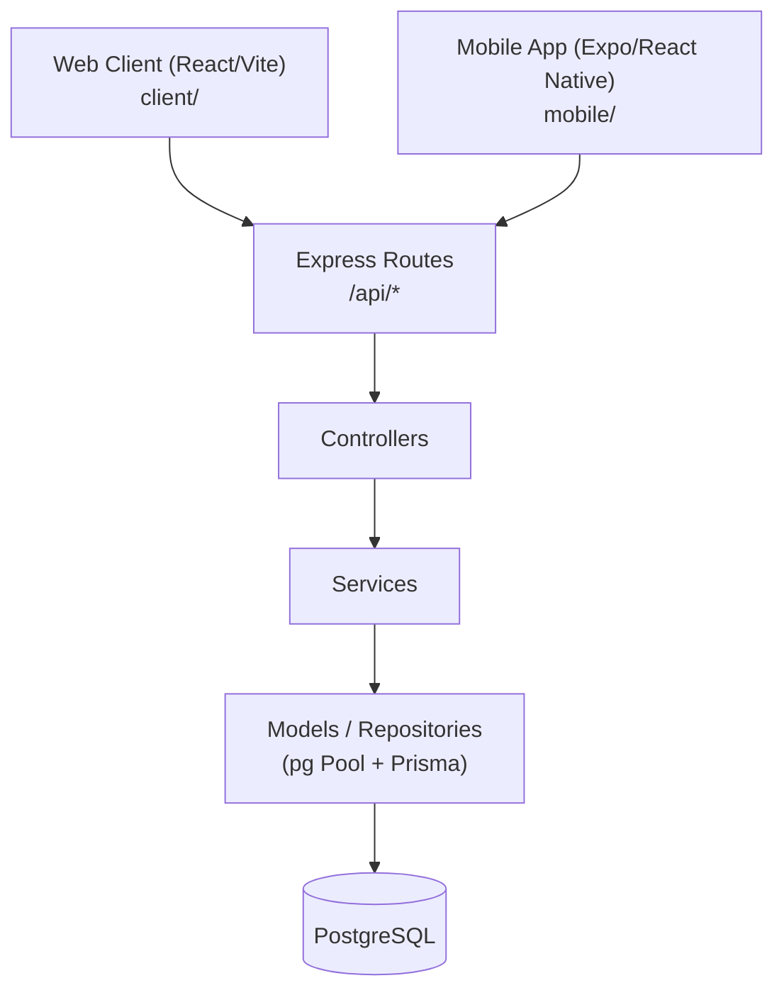
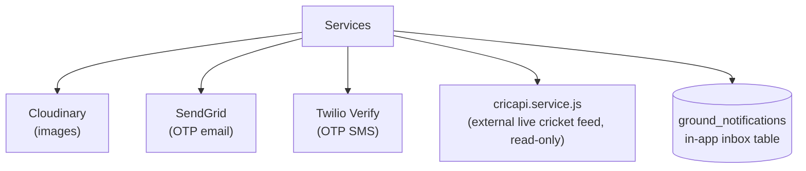

# 01 — System Overview

Full detail: see [../LOC_COMPLETE_DATA_FLOW.md § A](../LOC_COMPLETE_DATA_FLOW.md#a-system-overview).

## Request path



Both the web client and mobile app call the same `/api` REST surface — there is no separate mobile-only API.

## External services



## Backend layering

Express 4, plain JavaScript (ESM), Node ≥20:

```
routes/*.routes.js       — mounts middleware + multer + controller functions
controllers/*.controller.js — parses req/res, calls services
services/*.service.js    — business logic, transactions
models/*.model.js        — raw `pg` SQL (majority of tables)
repositories/**          — some raw SQL repos + repositories/prisma/*.prisma-repository.js
                            (sessions, otp_codes, part of grounds, staff_roles)
```

**Source of truth**: `server/src/config/schema.sql` is executed wholesale on every `npm run db:migrate` — it is the real, live DDL. `server/prisma/schema.prisma` is a stale, partially-outdated snapshot used only to generate `@prisma/client` for the handful of tables above.

## NOT IMPLEMENTED (confirmed)

- **Background job queue / scheduler** — no Bull/Agenda/cron worker exists. Anything resembling a scheduled reminder is computed inline during a request.
- **Push notifications** — no FCM/APNs/OneSignal. "Notifications" = in-app DB inbox only (`ground_notifications`), polled by clients.
- **Payments** — no gateway/webhook anywhere in `server/src`. See [05_API_DATABASE_MAPPING.md](05_API_DATABASE_MAPPING.md#payments--not-implemented).

Realtime scoring updates use `server/src/realtime/` (Socket.IO) — it broadcasts state already written via the REST endpoints in [07_MATCH_SCORING_FLOW.md](07_MATCH_SCORING_FLOW.md); it doesn't introduce new persisted data.
