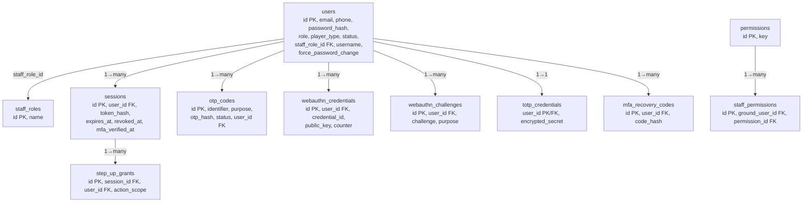
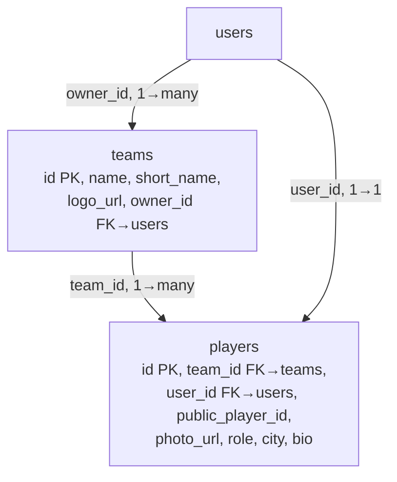
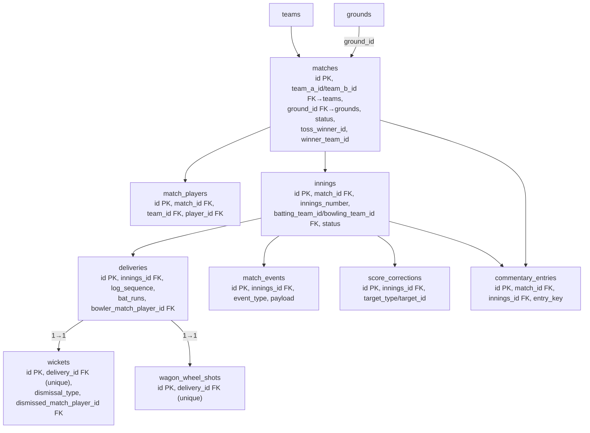
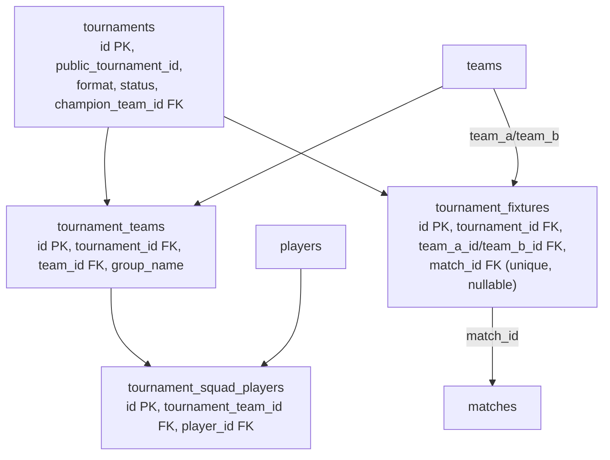
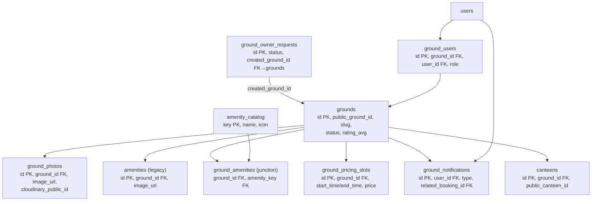
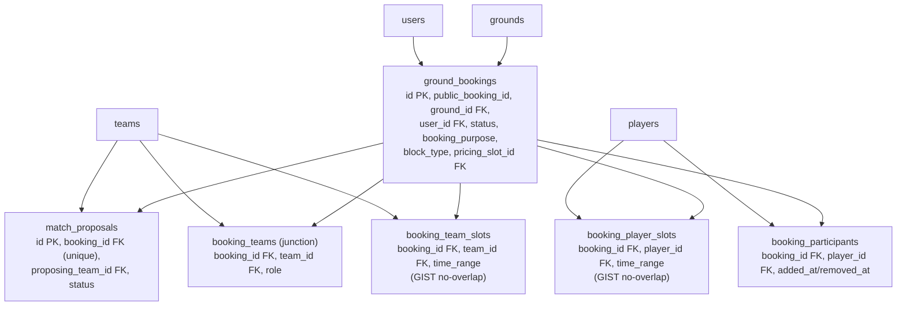
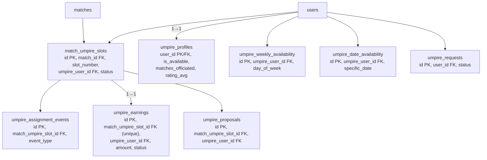
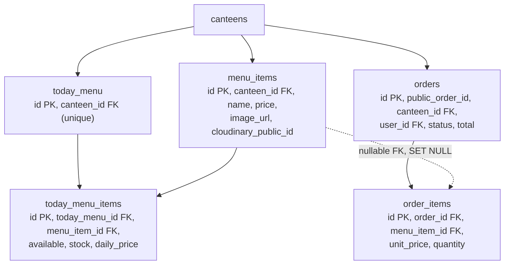
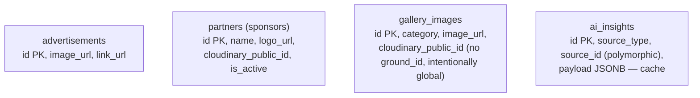
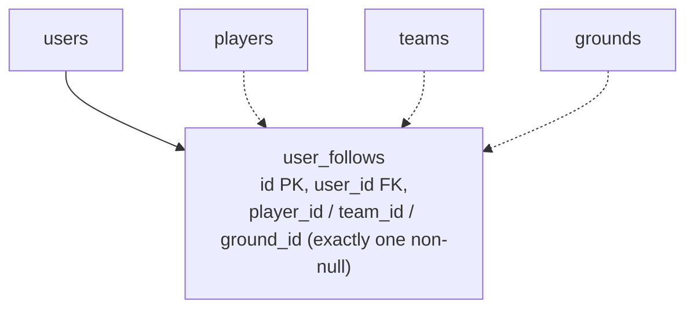

# 02 — Database Relationships (70 tables, 10 modules)

Full column-level dictionary: see [../LOC_COMPLETE_DATA_FLOW.md § B & C](../LOC_COMPLETE_DATA_FLOW.md#b-postgresql-database-map). Source of truth is `server/src/config/schema.sql` (not the stale `server/prisma/schema.prisma`).

## Auth / Users / Sessions / MFA

`users` is the hub table — referenced by nearly every other module as an actor/owner FK.

## Player & Team

## Matches & Scoring

`deliveries` is the append-only single source of truth for scoring; `innings` caches running totals derived from it.

## Tournaments

## Grounds & Ground Ops

## Booking Engine

Double-booking is prevented at the **database layer** by three PostgreSQL GIST exclusion constraints: `ground_bookings_no_overlap`, `booking_team_slots_no_overlap`, `booking_player_slots_no_overlap`.

## Umpire Module

## Canteen / Orders

## Content / CMS

## Social / Follow

One table backs all three follow types. `CHECK (num_nonnulls(player_id, team_id, ground_id) = 1)` guarantees exactly one target per row.
