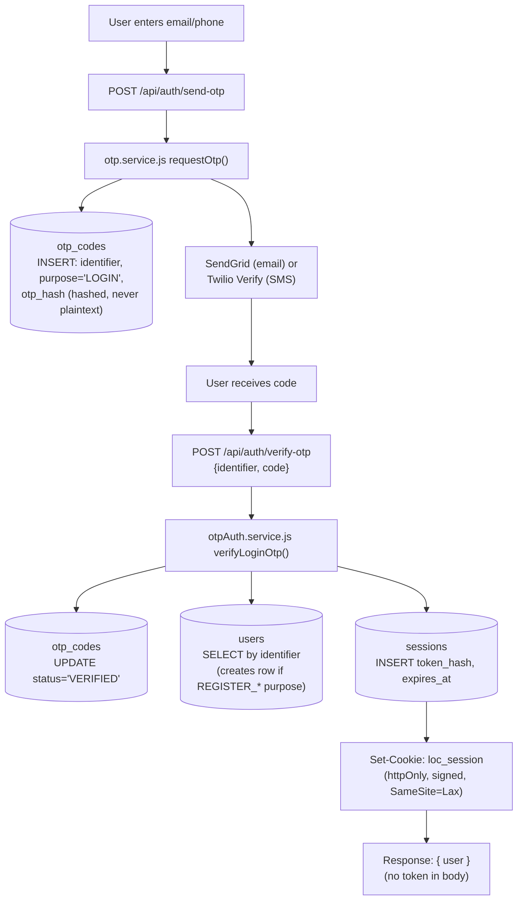
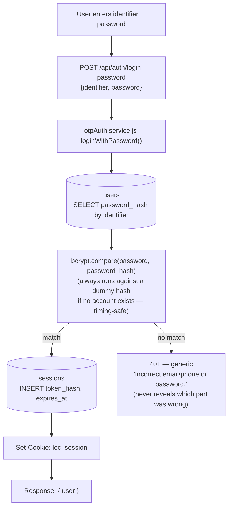
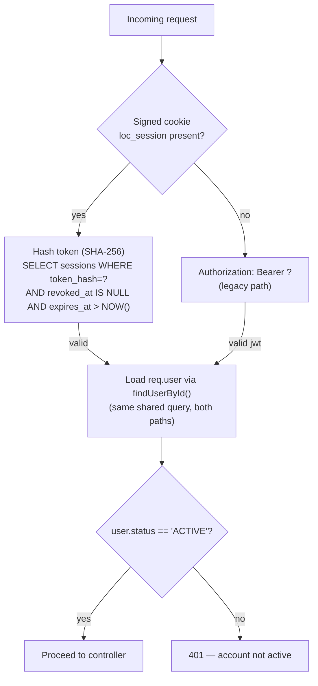
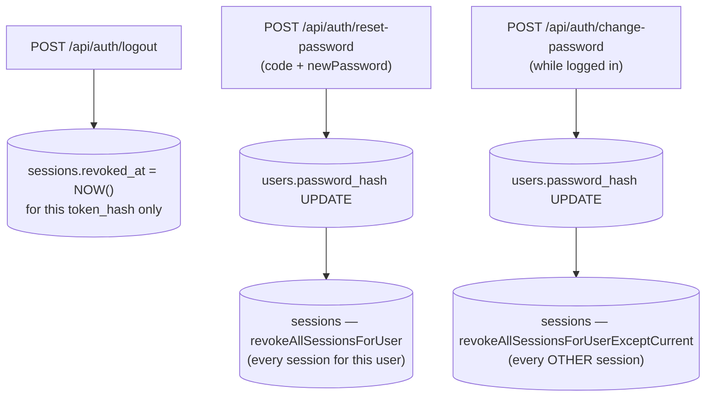

# 03 — Authentication & Login Flow

Full detail: see [../LOC_COMPLETE_DATA_FLOW.md § D](../LOC_COMPLETE_DATA_FLOW.md#d-authentication--login-flow).

LOC's primary auth mechanism is an **httpOnly signed session cookie**, not a bearer JWT returned in the response body. A legacy JWT bearer-token path (`signToken`/`verifyToken`) still exists in `requireAuth` but nothing in the active login flow calls `signToken` anymore — kept only for integration-test fixtures / old tokens.

## Register / OTP Login

`POST /api/auth/register/player` and `/register/umpire` stage an OTP with `purpose='REGISTER_PLAYER'`/`'REGISTER_UMPIRE'`; the actual `users` row is created inside `verify-otp` once the code is confirmed (a `REGISTER_UMPIRE` success also creates a pending `umpire_requests` row).

## Password Login

## Authenticated Request (`requireAuth`)

## Logout / Password Reset

## Key facts (verified in code)

| Question | Answer |
|---|---|
| Password hashing | `bcryptjs`, cost factor `10` |
| Password ever in plaintext/logs? | No — `users.password_hash` never leaves the DB layer; failures log a masked identifier only |
| OTP storage | `otp_codes.otp_hash` — hashed, single-use, purpose-scoped |
| Token model | No JWT refresh pair. Random 256-bit session token generated per login; only its SHA-256 hash stored (`sessions.token_hash`); raw token lives only in the httpOnly cookie |
| Cookie | `loc_session` — httpOnly, `secure` in prod, `SameSite=Lax`, signed with `SESSION_COOKIE_SECRET` |
| Session lifetime | `SESSION_TTL_DAYS` env var (default 30 days) |
| Revocation mechanism | `sessions.revoked_at IS NOT NULL` — no separate blacklist table |
| Current-user resolution | `middlewares/auth.js#requireAuth` — cookie branch (primary) or legacy JWT bearer branch, both converge on `findUserById()` |
| Role storage | `users.role` + `users.player_type` (platform) · `users.staff_role_id → staff_roles.name` (staff sub-role) · `ground_users.role` (per-ground role) |
| MFA (WebAuthn/TOTP/step-up) | Fully implemented (tables, routes, encryption) — **but `mfaState.service.js#computeMfaVerified()` is hardcoded to `return true`**. Enforcement is currently bypassed, per an explicit code comment. |
| Relevant env vars (names only) | `JWT_SECRET`, `SESSION_COOKIE_SECRET`, `DATABASE_URL`, `PG_*`, `MFA_ENCRYPTION_KEY`, `WEBAUTHN_RP_ID/RP_NAME/ORIGIN`, `SESSION_TTL_DAYS`, `OTP_LENGTH`, `OTP_TTL_MINUTES`, `TWILIO_*`, `SENDGRID_*`, `CLOUDINARY_*` |

No secrets/keys are shown anywhere in this documentation — only column and env var **names**.
