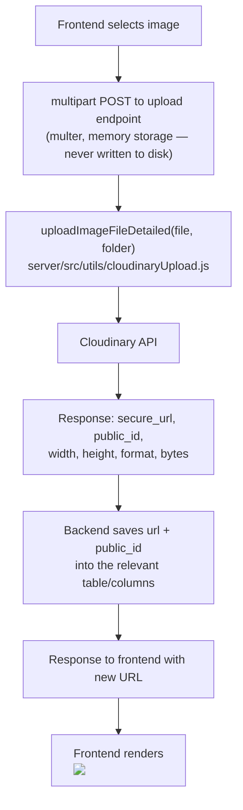
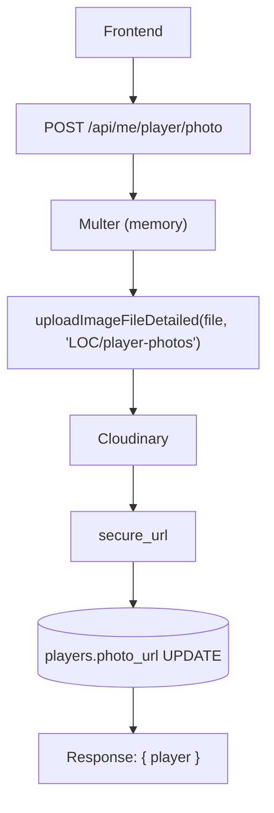

# 04 — Cloudinary / Image Upload Flow

Full detail: see [../LOC_COMPLETE_DATA_FLOW.md § E](../LOC_COMPLETE_DATA_FLOW.md#e-cloudinary--image-upload-flow).

## General flow

Shared validation: `image/jpeg`, `image/jpg`, `image/png`, `image/webp` only, max 10MB.

## Example: player profile photo

## Per-feature mapping (verified per controller)

| Feature | Endpoint | Cloudinary folder | Table.column(s) | `public_id` stored? | Delete/replace behavior |
|---|---|---|---|---|---|
| Player profile photo | `POST /api/me/player/photo` | `LOC/player-photos` | `players.photo_url` | **No** — no public_id column on `players` | Old photo **never deleted** (no way to know it's a Cloudinary asset vs. an arbitrary URL) |
| Ground photos (super admin) | `POST /api/ground-photos/upload` | `LOC/ground-photos` | `ground_photos.image_url`, `.cloudinary_public_id` | Yes | `cloudinary.uploader.destroy()` on delete/replace; rollback-on-DB-failure |
| Ground media (Ground Owner self-service) | `POST /api/ground-owner/grounds/:id/media/upload` | `LOC/ground-photos` | `ground_photos.image_url`, `.cloudinary_public_id` | Yes | Same delete + rollback pattern |
| Amenities (super admin, legacy) | `POST /api/amenities/upload` | `LOC/amenities` | `amenities.image_url`, `.cloudinary_public_id` | Yes | `destroy()` on delete/replace |
| Gallery images | `POST /api/gallery` | `LOC/ground-gallery` | `gallery_images.image_url`, `.cloudinary_public_id` (+width/height/format/bytes) | Yes | Cloudinary delete happens **before** DB row delete; row only removed if Cloudinary confirms success/"not found" |
| Partners/sponsor logos | `POST /api/partners/upload`, `PATCH /api/partners/:id` | `LOC/partners` | `partners.logo_url`, `.cloudinary_public_id` | Yes | Old logo deleted only after DB update commits |
| Ground registration photos (wizard) | `POST /api/ground-owner-requests/photos` | `LOC/ground-registration-photos` | `ground_registration_photos.image_url`, `.cloudinary_public_id` | Yes | Attached to the request row once submitted |
| Canteen menu item images | menu create/update (field `imageFile`) | `canteen-menu` | `menu_items.image_url`, `.cloudinary_public_id` | Yes (`uploadImageFileDetailed`, verified in `canteenMenu.controller.js`) | Old image replaced via `deleteImageByPublicId` on update |
| Team logo | *(not a Cloudinary upload)* | — | `teams.logo_url` | N/A | Client supplies an arbitrary URL string directly — no multer/Cloudinary involved |

An image can alternatively be added by supplying a raw external `imageUrl` in the request body (ground photos/amenities), bypassing Cloudinary — `cloudinary_public_id` is explicitly set `null` in that case, and delete code correctly skips `destroy()` when `public_id` is null.

Deletion helper: `deleteImageByPublicId(publicId)` → `cloudinary.uploader.destroy(publicId, {resource_type:'image'})`. Delivery-time transforms (`f_auto,q_auto`, optional width cap) are generated on the fly via `getOptimizedImageUrl()` — no second copy is stored.
