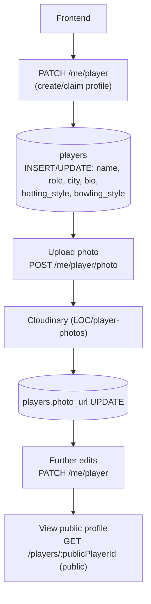
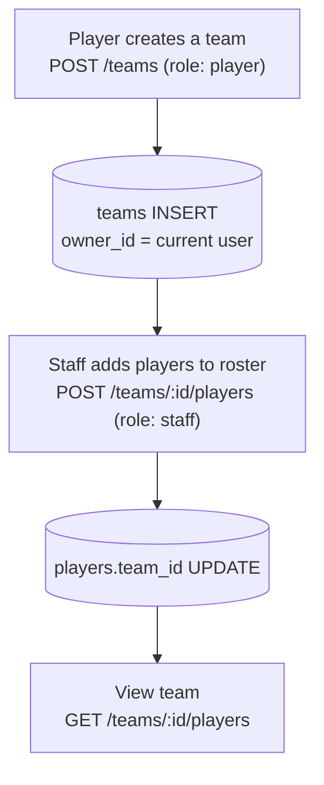

# 06 — User / Player / Team Profile Flow

Table reference: [02_DATABASE_RELATIONSHIPS.md](02_DATABASE_RELATIONSHIPS.md#player--team). API reference: [05_API_DATABASE_MAPPING.md](05_API_DATABASE_MAPPING.md#player--team).

## Create profile → upload photo → update

## Create a team → add players

## Key facts

- One optional 1:1 link exists between `users` and `players` via `players.user_id` (unique partial index — only enforced when non-null). A player profile can exist without ever being claimed by a `users` account (e.g. added to a roster by a scorer).
- `teams.owner_id → users.id` — ownership was added later (Phase 5D.4); teams created before that have `owner_id = NULL`.
- `players.photo_url` stores a plain URL string with **no Cloudinary `public_id` tracked** — see [04_CLOUDINARY_UPLOAD_FLOW.md](04_CLOUDINARY_UPLOAD_FLOW.md) for why the old photo is never deleted on replace.
- `teams.logo_url` is **not** a Cloudinary upload — the client supplies an arbitrary URL string directly in the request body.
