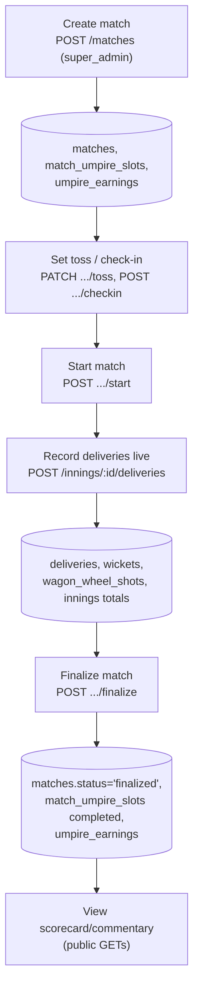
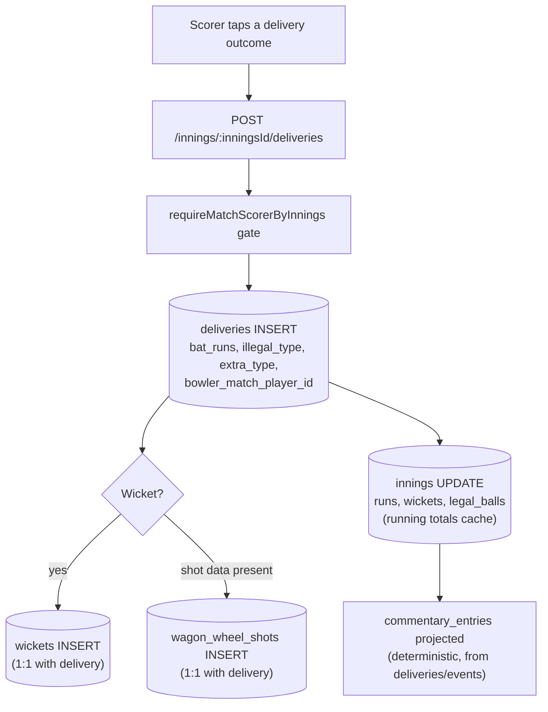
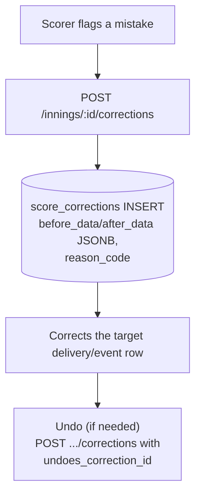

# 07 — Match & Scoring Flow

Table reference: [02_DATABASE_RELATIONSHIPS.md](02_DATABASE_RELATIONSHIPS.md#matches--scoring). API reference: [05_API_DATABASE_MAPPING.md](05_API_DATABASE_MAPPING.md#matches--scoring).

## Match lifecycle

## Recording one delivery (ball-by-ball)

## Corrections (undo)

## Key facts

- `deliveries` is **append-only** and the single source of truth; `innings.runs`/`.wickets`/`.legal_balls` are derived caches recomputed from it.
- `matches.status` has **no DB-level CHECK constraint** (unlike `innings.status`) — valid values (`upcoming`/`live`/`completed`/`finalized`/`cancelled`) are inferred from application code only. `UNKNOWN — REQUIRES VERIFICATION` for a complete enum guarantee.
- `score_corrections` is an immutable audit trail — corrections never delete history, they append a new row and reference `undoes_correction_id` for undo-of-undo chains.
- Live scoring is also broadcast over Socket.IO (`server/src/realtime/`) but that only mirrors state already written via these REST endpoints — no separate persisted data path.
