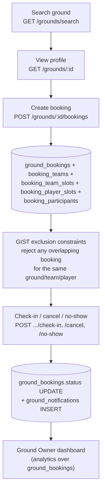
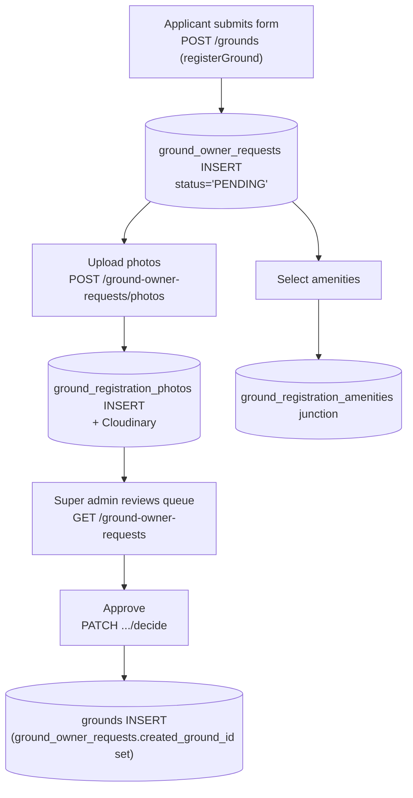
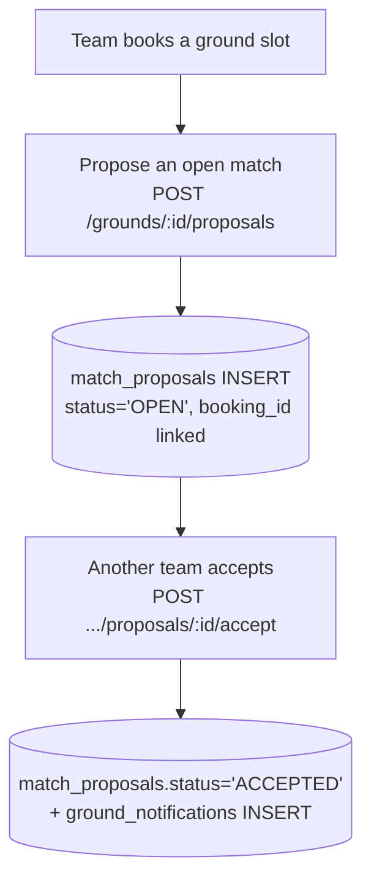

# 08 — Ground & Booking Flow

Table reference: [02_DATABASE_RELATIONSHIPS.md](02_DATABASE_RELATIONSHIPS.md#booking-engine). API reference: [05_API_DATABASE_MAPPING.md](05_API_DATABASE_MAPPING.md#grounds--booking).

## Search → book → check-in

## Ground registration (new ground onboarding)

## Match proposal ("looking for opponent")

## Key facts

- Double-booking is prevented at the **database layer**, not just application logic: `ground_bookings_no_overlap`, `booking_team_slots_no_overlap`, `booking_player_slots_no_overlap` are PostgreSQL GIST exclusion constraints (visible only via `pg_constraint`, not `information_schema`).
- `ground_bookings.booking_type` distinguishes `CUSTOMER` bookings from `STAFF_BLOCK` (ground maintenance/closure blocks).
- `ground_bookings.match_format` has no CHECK constraint documenting its allowed values — `UNKNOWN — REQUIRES VERIFICATION`.
- Registering a ground does **not** create a `grounds` row directly — it creates a `ground_owner_requests` row that must be approved first.
- No payment/checkout step exists in the booking flow — see [05_API_DATABASE_MAPPING.md § Payments](05_API_DATABASE_MAPPING.md#payments--not-implemented).
