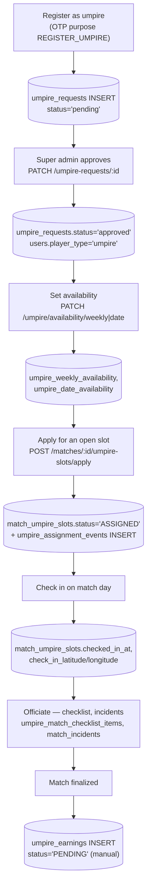
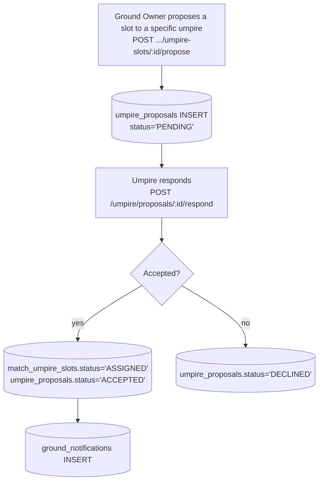
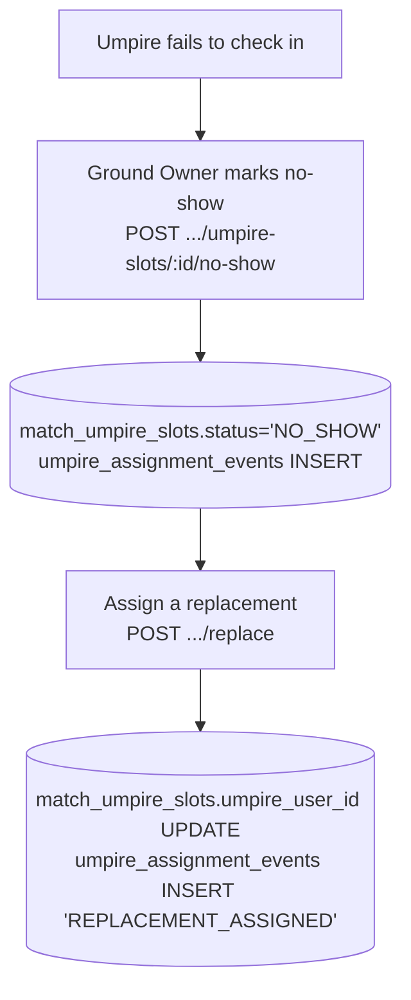

# 09 — Umpire Flow

Table reference: [02_DATABASE_RELATIONSHIPS.md](02_DATABASE_RELATIONSHIPS.md#umpire-module). API reference: [05_API_DATABASE_MAPPING.md](05_API_DATABASE_MAPPING.md#umpire).

## Registration → approval → assignment → earnings

## Ground Owner direct proposal (alternative to self-apply)

## No-show / replacement

## Key facts

- `umpire_earnings.status` is a **manual** enum (`PENDING/APPROVED/PAID/FAILED/CANCELLED`) — no real payment gateway backs it; only a Ground Owner can move it via `PATCH .../payment-status`.
- `umpire_assignment_events` and `umpire_match_checklist_items` are append-only history/audit tables, never overwritten.
- Umpire reputation/leaderboard (`GET /stats/top-umpires`) is computed from aggregates over `match_umpire_slots` and `match_feedback_umpire_ratings` — there's no separate "reputation score" column stored anywhere.
