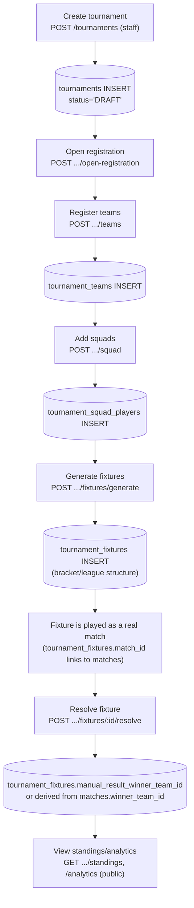

# 10 — Tournament Flow

Table reference: [02_DATABASE_RELATIONSHIPS.md](02_DATABASE_RELATIONSHIPS.md#matches--scoring) (tournaments section). API reference: [05_API_DATABASE_MAPPING.md](05_API_DATABASE_MAPPING.md#tournaments).

## Create → register → play → standings

## Key facts

- A `tournament_fixtures` row can exist **without** a linked `matches` row yet (`match_id` is nullable) — it becomes linked once the actual match is created/scheduled.
- `tournament_fixtures.stage` distinguishes `LEAGUE`/`GROUP`/`QUARTER_FINAL`/`SEMI_FINAL`/`FINAL`; `tournaments.format` distinguishes `LEAGUE`/`GROUPS_KNOCKOUT`/`KNOCKOUT`.
- Tournament analytics/statistics (`GET .../statistics`, `.../analytics`) are computed on the fly from `matches`, `innings`, `match_players`, `wickets` — no separate pre-aggregated stats table exists for tournaments.
- `tournament_squad_players` is a **historical snapshot** — removing a player from a team later doesn't retroactively change who was in a completed tournament's squad.
