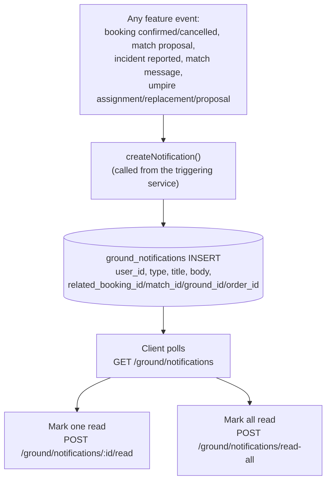

# 11 — Notifications Flow

Table reference: [02_DATABASE_RELATIONSHIPS.md](02_DATABASE_RELATIONSHIPS.md#grounds--ground-ops). API reference: [05_API_DATABASE_MAPPING.md](05_API_DATABASE_MAPPING.md#notifications-follow-stats).

There is **no standalone "notifications" module** — it's an internal in-app inbox backed entirely by one table, `ground_notifications`, written as a side effect by many feature services.

## Trigger → store → read

## Triggering services (confirmed callers of `createNotification`)

`bookingConflict.service`, `groundBooking.service`, `groundOwner.service`, `groundStaff.service`, `matchIncident.service`, `matchMessage.service`, `matchProposal.service`, `umpireAssignment.service`, `umpireProposal.service` — covering booking confirm/cancel, umpire assignment/replacement, umpire proposal sent/accepted, match messages, and incident reports.

## Key facts — `NOT IMPLEMENTED`

- **No push notification provider** (no FCM/APNs/OneSignal). Notifications only ever appear inside the app when the client polls `GET /ground/notifications` — nothing is pushed to a device.
- **No background scheduler** — reminder-style notification types exist in the `ground_notifications.type` enum (e.g. `UMPIRE_REMINDER_24H`/`2H`/`30M`, `BOOKING_EXPIRING_SOON`) but nothing was found that fires them on a timer; they would need to be triggered by a request happening to run at the right time, or are aspirational enum values not yet wired to a caller. `UNKNOWN — REQUIRES VERIFICATION` for exactly which reminder types are actually fired today.
- `ground_notifications.is_read` is the only read-state — there's no per-notification delivery/seen distinction beyond read/unread.
