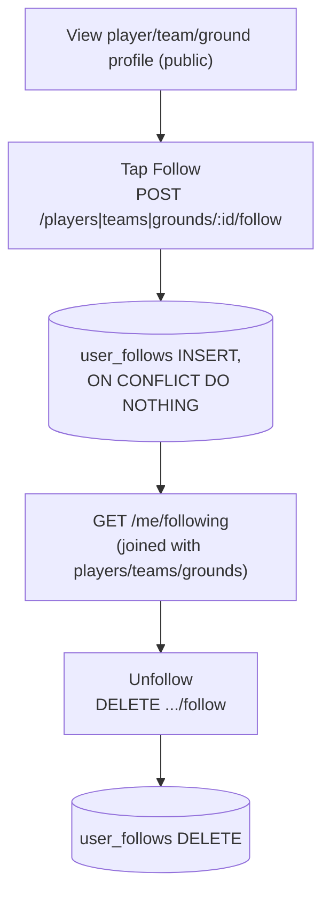
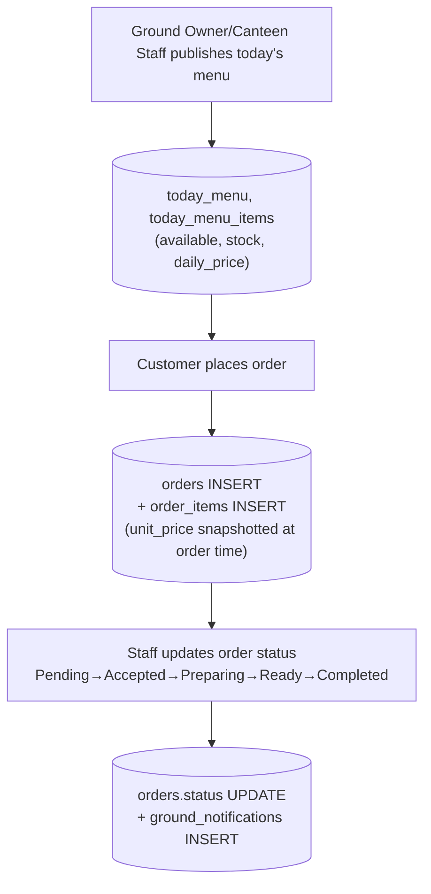
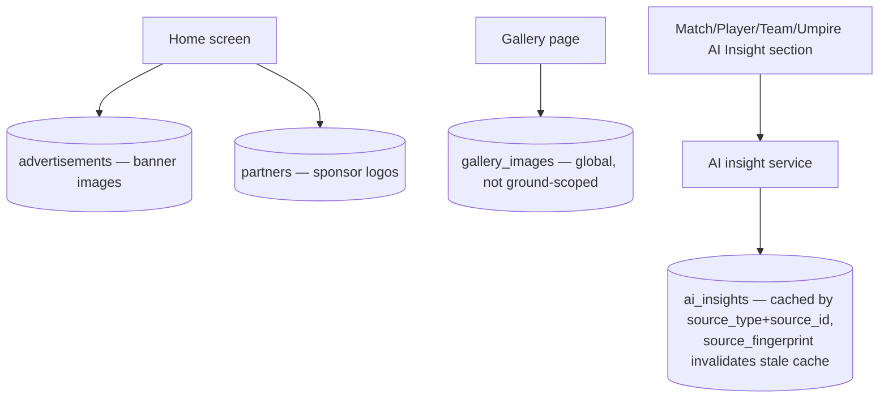

# 12 — Other Feature Flows (Follow, Canteen, Content/CMS)

## Follow (players / teams / grounds)

Table reference: [02_DATABASE_RELATIONSHIPS.md](02_DATABASE_RELATIONSHIPS.md#social--follow).

One table, `user_follows`, backs all three follow types (`CHECK num_nonnulls(player_id, team_id, ground_id) = 1`).

## Canteen ordering

Table reference: [02_DATABASE_RELATIONSHIPS.md](02_DATABASE_RELATIONSHIPS.md#canteen--orders).

`order_items.unit_price` is a permanent snapshot — later menu price changes never retroactively affect a past order.

## Content / CMS (Advertisements, Partners, Gallery, AI Insights)

Table reference: [02_DATABASE_RELATIONSHIPS.md](02_DATABASE_RELATIONSHIPS.md#content--cms).

`gallery_images` deliberately has **no `ground_id`** — the schema comment confirms this is intentional, the gallery stays global rather than per-ground.

## Payments — `NOT IMPLEMENTED`

No flow diagram is provided here because none exists in the codebase. See [05_API_DATABASE_MAPPING.md § Payments](05_API_DATABASE_MAPPING.md#payments--not-implemented) for the full confirmation (no gateway SDK, no webhook route, only manual payment-status enums on umpire earnings).
